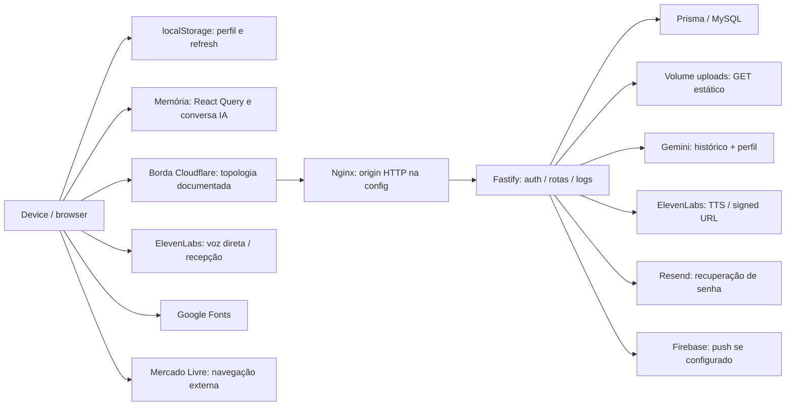

# LGPD e privacidade — arquitetura, mercado e posicionamento

Data: 17/09/2026. Versão: 1.0. Branch: `codex/lgpd-privacy-assessment`. Base examinada: `fc901a10b4fa715f46fc3f819212fa451fea8e1c`.

**[PRODUTO] Recomendação:** financiar um mínimo defensável antes de ampliar a base e evoluir para o padrão sólido em seguida. Priorizar confidencialidade efetiva, legitimidade do tratamento e capacidade operacional de atender titulares. Não prometer E2E, anonimato ou ausência de treinamento sem demonstrar essas propriedades.

**[TÉCNICO] Escopo e evidência:** análise estática das fontes React/Capacitor, rotas Fastify, Prisma/migrations, dependências declaradas, configs nativas, deploy e documentos. Nenhum código de produção foi alterado, nenhum dado real foi consultado e nenhum serviço de produção foi testado. `[VERIFICADO]` significa demonstrável no repositório; não comprova a versão implantada. `[SUPOSIÇÃO]` identifica configuração externa, consequência ainda não reproduzida ou hipótese. Propostas e estimativas são identificadas como tais. Caminhos e símbolos acompanham afirmações sobre a implementação; em HTML/config, o símbolo é a seção, chave ou bloco. Ausências são limitadas às fontes examinadas.

**[JURÍDICO] Premissa:** medicamentos e consultas são dados sensíveis de saúde (LGPD, art. 5º, II). Também tratar conservadoramente gestação, pós-parto e inferências emocionais como saúde; religião e biometria identificadora têm regime sensível próprio. Nome/data de nascimento de criança exigem proteção infantil mesmo quando não constituem saúde. O advogado deve fechar classificação, bases e obrigações por finalidade. Fonte normativa: [LGPD compilada, arts. 5º–6º](https://www.planalto.gov.br/ccivil_03/_ato2015-2018/2018/lei/l13709compilado.htm).

## Parte 1 — Diagnóstico atual

### 1.1 Inventário de dados pessoais

**[TÉCNICO] [VERIFICADO] Convenções de armazenamento e retenção.** As tabelas abaixo enumeram campos escalares pessoais, inclusive identificadores e metadados. Relações Prisma são referências aos mesmos registros, não novos campos coletados. `R0` = persistência sem expurgo temporal encontrado: permanece até uma operação explícita de exclusão, quando existir. Não significa que seja legítimo reter indefinidamente. Não foi encontrado job de retenção nas fontes `server/src` e nos scripts de `server/package.json:scripts`; a fonte de cada tabela é `server/prisma/schema.prisma:<modelo>`. `createdAt/updatedAt` não estabelecem prazo de guarda. Limites de consulta de 50 registros ou janela de analytics de 30 dias também não apagam registros.

**[TÉCNICO] [SUPOSIÇÃO] Acesso operacional comum.** Quem tem credenciais de MySQL, shell, volumes ou backups pode acessar dados armazenados; a lista real de pessoas e os controles do provedor não são comprováveis em `deploy/docker-compose.prod.yml:services.mysql/api` e `HARNESS.md:Infraestrutura de Produção`. Nas tabelas, “própria” descreve a API; não exclui esse acesso operacional. Terceiros estão detalhados em 1.2, para não repetir cada destinatário.

| Categoria/classificação | Campos pessoais armazenados | Entrada → armazenamento; acesso pela aplicação; retenção | Evidência de código [TÉCNICO] |
|---|---|---|---|
| Identificação — comum | `User.id, email, username, name, babyName, motherBirthDate, avatarUrl, bio` | Cadastro e edição; avatar via upload/URL → MySQL, arquivo em volume quando enviado. Email/data da mãe/nome do bebê: própria via `USER_SELECT`. Nome/username/avatar/bio: outras autenticadas. Bio/foto podem conter dado sensível. `R0`; edição substitui campo, sem coletor de arquivos antigos. | [VERIFICADO] `server/prisma/schema.prisma:User`; `server/src/routes/auth.ts:registerSchema, authRoutes POST /register`; `server/src/routes/users.ts:updateMeSchema, usersRoutes GET /:id e PATCH /me`; `server/src/lib/user-select.ts:USER_SELECT`; `server/src/routes/uploads.ts:uploadsRoutes`. |
| Gestação/pós-parto — **saúde sensível** | `User.pregnancyStage, pregnancyWeek, babyAgeInDays, babyBirthDate, expectedBirthDate, hasMultiples` | Cadastro/edição → MySQL. Própria; fase/semana/idade em dias também retornam para outras autenticadas no perfil. Datas exatas/múltiplos retornam no próprio perfil. `R0`. | [VERIFICADO] `server/prisma/schema.prisma:User`; `server/src/routes/auth.ts:registerSchema`; `server/src/routes/users.ts:updateMeSchema, usersRoutes GET /:id`; `server/src/lib/user-select.ts:USER_SELECT` (todos sob `server/` nos caminhos acima). |
| Perfil emocional e inferências — **tratar como saúde sensível** | `User.mood, supportNetwork, goal, concern, onboardingAnswers, profileKey, archetypeKey` | Onboarding → MySQL; JSON inclui `q1…q5, goals, concerns`. `profileKey/archetypeKey` são derivados por regras. Própria; chaves também retornam no perfil de outra usuária, e arquétipo em autores/chats/busca. Contexto de IA em 1.2. `R0`. | [VERIFICADO] `server/src/routes/auth.ts:authRoutes POST /register, answersWithMulti`; `server/src/lib/profile.ts:computeProfileFromLetters, pickProfileKey`; `server/prisma/schema.prisma:User`; `server/src/routes/users.ts:usersRoutes GET /:id`; `server/src/routes/search.ts:searchRoutes`; `server/src/routes/chats.ts:chatsRoutes`; `server/src/routes/posts.ts:postsRoutes/postInclude`. |
| Estado de conta/configuração — comum, associado a sensíveis | `User.role, onboardingDone, versesPublic, termsAcceptedAt, createdAt, updatedAt` | Default/cadastro/edição → MySQL. Própria; papel/visibilidade de versículos também no perfil alheio. `termsAcceptedAt` é horário de aceite genérico, não consentimento de saúde. `R0`. | [VERIFICADO] `server/prisma/schema.prisma:User`; `server/src/routes/auth.ts:authRoutes`; `server/src/routes/users.ts:updateMeSchema, usersRoutes`; `server/src/lib/user-select.ts:USER_SELECT`. |
| Credenciais/sessão — comum, alto impacto | `User.passwordHash, passwordResetToken, passwordResetExpires`; `RefreshToken.id, token, userId, expiresAt, createdAt` | Senha recebida transitoriamente; bcrypt custo 12 → hash MySQL. Reset aleatório em texto recuperável no banco e link de email; válido 1h, campo limpo ao usar, não há expurgo após expirar. Refresh JWT recuperável no banco, validade 30d, removido em logout/rotação/reset; expirados não usados podem permanecer (`R0`). Access JWT 15min em memória. Apenas endpoints de autenticação manipulam; sem retorno de hash. | [VERIFICADO] `server/src/routes/auth.ts:authRoutes, COOKIE_OPTS`; `server/src/utils/tokens.ts:signAccessToken, signRefreshToken`; `server/prisma/schema.prisma:User, RefreshToken`. |
| Dispositivo — comum | `User.fcmToken` | Permissão nativa → `PUT /users/fcm-token` → MySQL; própria escrita; backend usa para push. `platform` chega no body mas não é persistida pelo handler. Um token por conta; overwrite, sem prazo nem remoção no logout (`R0`). | [VERIFICADO] `src/App.tsx:App/registerFcm`; `server/src/routes/users.ts:usersRoutes PUT /fcm-token`; `server/prisma/schema.prisma:User.fcmToken`; `server/src/plugins/fcm.ts:sendPush`; `server/src/routes/auth.ts:authRoutes POST /logout`. |
| Bebês — infantil; `weekAtEntry` e contexto gestacional: **saúde sensível** | `Baby.id, userId, name, birthDate, weekAtEntry, createdAt` | API de cadastro aceita datas/semanas; UI atual envia sobretudo nomes → MySQL. Própria via `USER_SELECT`; cópia local em 1.3. `R0`, cascade com User. | [VERIFICADO] `server/prisma/schema.prisma:Baby`; `server/src/routes/auth.ts:babyInputSchema, authRoutes`; `src/components/auth/RegisterScreen.tsx:RegisterScreen/mutationFn`; `server/src/lib/user-select.ts:USER_SELECT`. |
| Outros filhos — infantil, comum; conteúdo adicional pode ser sensível | `OtherChild.id, userId, name, birthDate, createdAt` | Onboarding opcional; nome/data exata obrigatórios se houver registro → MySQL. Própria, cópia local. `R0`, cascade com User. | [VERIFICADO] `server/prisma/schema.prisma:OtherChild`; `server/src/routes/auth.ts:otherChildInputSchema, authRoutes`; `src/components/auth/steps/StepOutrosFilhos.tsx:StepOutrosFilhos`; `server/src/lib/user-select.ts:USER_SELECT`. |
| Rotina — medicamentos/consultas: **saúde sensível**; tarefa pode conter saúde | `RoutineEntry.id, userId, time, date, title, category, notes, done, createdAt` | Jornada/adicionar evento → `/routine` → MySQL. Leitura/edição/exclusão filtradas por dono; `R0` até DELETE explícito. Não há campos separados de dosagem, médico ou estabelecimento: texto livre pode conter essas informações. | [VERIFICADO] `server/prisma/schema.prisma:RoutineEntry`; `server/src/routes/routine.ts:createSchema, updateSchema, routineRoutes`; `src/components/home/AddRoutineModal.tsx:AddRoutineModal`; `src/components/home/EventDetailModal.tsx:EventDetailModal`. |
| Cuidados do bebê — **saúde sensível infantil** | `BabyEntry.id, userId, time, type, detail, createdAt` | Registros de sono/alimentação/fralda → `/baby` → MySQL. Própria; GET últimos 50, não expurgo; `R0`. Sem `babyId`: registro é ligado à mãe, não distingue bebês no modelo. | [VERIFICADO] `server/prisma/schema.prisma:BabyEntry`; `server/src/routes/baby.ts:createSchema, babyRoutes`; `src/components/home/QuickRegisterSheet.tsx:QuickRegisterSheet`. |
| Comunidade/conteúdo — pessoal; saúde/religião conforme conteúdo ou associação | `Community.id, name, description, category, colorKey, imageUrl, avatarUrl, isPrivate, isOpen, creatorId, createdAt`; `CommunityMember.userId, communityId, role, joinedAt` | Criação, associação e gestão → MySQL/URLs de arquivos. Metadados das comunidades autenticados; membros de privada condicionados a associação. Pertencer a grupo de saúde pode revelar informação sensível. `R0`, leave apaga associação; criador permanece referenciado. | [VERIFICADO] `server/prisma/schema.prisma:Community, CommunityMember`; `server/src/routes/communities.ts:createSchema, communitiesRoutes GET /, /:id, /:id/members e DELETE /:id/join`; `server/src/routes/search.ts:searchRoutes`. |
| Posts/reposts — pessoal, potencialmente **sensível** | `Post.id, content, category, imageUrl, authorId, communityId, isRepost, repostFromId, createdAt` | Composer/repost → MySQL/URL de arquivo. Autenticadas; privacidade inconsistente (1.6). `R0`; DELETE autor apaga registro, não arquivo. Repost também copia conteúdo quando não há citação. | [VERIFICADO] `server/prisma/schema.prisma:Post`; `server/src/routes/posts.ts:createSchema, postsRoutes POST /, /:id/repost, DELETE /:id`; `src/components/comunidade/CreatePostScreen.tsx:CreatePostScreen`. |
| Comentários/reação — pessoal, potencialmente **sensível** | `Comment.id, content, authorId, postId, parentId, likes, createdAt`; `PostLike.userId, postId, createdAt`; `CommentLike.userId, commentId, createdAt` | Interações → MySQL. Comentários retornam para autenticadas sem guard de comunidade do post; própria reação pode ser removida. `R0`; não foi encontrada rota de edição/exclusão de comentário em `postsRoutes`. | [VERIFICADO] `server/prisma/schema.prisma:Comment, PostLike, CommentLike`; `server/src/routes/posts.ts:commentSchema, findCommentInPost, postsRoutes GET/POST /:id/comments e rotas /like`. |
| Grafo social — pessoal; pode inferir sensíveis | `Follow.followerId, followingId, createdAt` | Follow/unfollow → MySQL. Listas autenticadas de seguidores/seguidos; `R0` até unfollow/cascade. | [VERIFICADO] `server/prisma/schema.prisma:Follow`; `server/src/routes/users.ts:usersRoutes /:id/follow, /:id/followers, /:id/following`. |
| Chat — privado, potencialmente **sensível** | `Chat.id, createdAt`; `ChatParticipant.userId, chatId`; `Message.id, content, chatId, senderId, sharedPostId, sharedPostAuthor, sharedPostExcerpt, audioUrl, imageUrl, read, createdAt` | Texto/foto/MediaRecorder → upload + `/chats` → MySQL e volume. Participantes leem/enviam mensagens; arquivos em 1.6. `R0`; apagar chat só remove a participação de quem pediu. Autor pode apagar mensagem; não apaga mídia. Snapshots compartilhados não são FK de Post. | [VERIFICADO] `server/prisma/schema.prisma:Chat, ChatParticipant, Message`; `server/src/routes/chats.ts:sendMessageSchema, chatsRoutes`; `src/components/chat/ChatScreen.tsx:ChatScreen, mediaRecorderRef`; `server/src/routes/uploads.ts:uploadsRoutes`. |
| Notificações — pessoal; excerpt pode conter **sensível** | `Notification.id, type, text, read, recipientId, targetType, targetId, actorId, actorName, postExcerpt, createdAt` | Eventos sociais → MySQL; destinatária; último 50, `R0`. Ator/nome/excerpt são cópias independentes de perfil/conteúdo; marcação como lida não elimina. | [VERIFICADO] `server/prisma/schema.prisma:Notification`; `server/src/routes/posts.ts:postsRoutes`; `server/src/routes/users.ts:usersRoutes POST /:id/follow`; `server/src/routes/notifications.ts:notificationsRoutes`. |
| Versículos/orações — potencial **convicção religiosa sensível** e saúde em texto livre | `SavedVerse.id, verseRef, userId, createdAt`; local `versesByUser, prayersByUser` | Salvar versículo → MySQL e/ou estado local; oração livre → local. Própria; referências do banco podem ser vistas por autenticadas quando `versesPublic=true`, default false. `R0`; DELETE de referência e unsave local existem; oração não tem rota de servidor identificada. | [VERIFICADO] `server/prisma/schema.prisma:SavedVerse, User.versesPublic`; `server/src/routes/users.ts:usersRoutes /me/verses, /:id/verses`; `src/store/useAppStore.ts:saveVerse, unsaveVerse, savePrayer, partialize`. |
| Loja afiliada — comum, possível inferência de saúde | `ProductClick.id, productId, userId, clickedAt`; `Review.id, rating, text, verifiedPurchase, userId, productId, createdAt, updatedAt`; `WishlistItem.id, userId, productId, createdAt` | Clique autenticado ou redirect anônimo, review/favorito → MySQL. Click sem FK de User; analytics agregada ADMIN/EDITOR; reviews exibidos a autenticadas; wishlist própria. `R0`; favorito é toggle. `verifiedPurchase` é inferido de clique, não comprovação de compra. | [VERIFICADO] `server/prisma/schema.prisma:ProductClick, Review, WishlistItem`; `server/src/routes/products-public.ts:publicProductsRoutes POST /:id/click, GET /:id/comprar, POST /:id/reviews`; `server/src/routes/admin/analytics.ts:adminAnalyticsRoutes`; `server/src/routes/wishlist.ts:wishlistRoutes`. |

**[TÉCNICO] [VERIFICADO] Dados transitórios fora do schema.** Login recebe `identifier/password`; reset recebe email/token/senha; busca/autocomplete recebem `q/username`; produtos recebem `phase` no query; uploads recebem bytes e MIME. A IA recebe `messages[].role/content` (até 20 × 4.000 caracteres) e contexto gerado; voz recebe áudio/texto e devolve transcrições/respostas; TTS recebe `text` (até 500 caracteres). Não há tabela de conversa de IA identificada. Fontes: `server/src/routes/auth.ts:loginSchema, authRoutes`; `server/src/routes/search.ts:searchRoutes`; `server/src/routes/products-public.ts:publicProductsRoutes`; `server/src/routes/uploads.ts:uploadsRoutes`; `server/src/routes/mae-ia.ts:chatBodySchema, maeIARoutes`; `server/src/routes/sara.ts:saraRoutes`; `src/components/maeIA/MaeIAScreen.tsx:messages, sendText`; `src/components/reception/hooks/useSaraNarration.ts:startConversation, sendTextResponse`.

**[TÉCNICO] [VERIFICADO] Dados históricos não equivalem ao modelo atual.** Endereços, pedidos, carrinho, métodos de pagamento e cliente Mercado Pago foram removidos do schema e a migration contém DROP das respectivas tabelas/campo. Não há CPF/documento/selfie/prova de vida nem modelos de denúncia no schema atual. Fontes: `server/prisma/schema.prisma:User e modelos declarados`; `server/prisma/migrations/20260825190502_drop_commerce_tables/migration.sql:DROP TABLE Address/Order/PaymentMethod e ALTER TABLE User`; `server/src/index.ts:registros de rotas`. **[SUPOSIÇÃO]** A migration pode não ter sido aplicada em produção e dados antigos podem sobreviver em backups: conferir banco efetivo, histórico de deploy e retenção do processador, sem coletar conteúdo desnecessário.

### 1.2 Fluxo do dado e terceiros

**[TÉCNICO] [VERIFICADO] Fluxo implementado.** O diagrama representa chamadas e destinos definidos no código, não um teste de tráfego nem prova da topologia implantada. Fontes: `src/lib/api.ts:apiFetch, apiStream, uploadImage, resolveMediaUrl`; `server/src/index.ts:fastify/register`; `server/src/plugins/prisma.ts:prismaPlugin`; `deploy/docker-compose.prod.yml:services/volumes`; `server/src/routes/mae-ia.ts:maeIARoutes`; `src/components/reception/hooks/useSaraNarration.ts:startConversation`.

| Serviço/camada | Dados que recebe e tratamento observado | Situação/retorno/retensão a confirmar [TÉCNICO] |
|---|---|---|
| Hostinger / VPS | Banco, uploads, processo e logs no deploy documentado. | [VERIFICADO] `HARNESS.md:Infraestrutura de Produção`; `deploy/docker-compose.prod.yml:volumes`. [SUPOSIÇÃO] Região, snapshots, criptografia do host e acesso do suporte não foram verificados. |
| Cloudflare | Borda proxy documentada; termina HTTPS e pode processar requests/respostas em claro na borda, além de IP/headers. | [VERIFICADO] `HARNESS.md:Domínio da API`; `deploy/nginx-api.santoti.com.conf:server/location /`. [SUPOSIÇÃO] Proxy ativo, WAF, cache/logging e localização de tratamento precisam de painel/contrato. Não confundir DNS com processamento do proxy. |
| Gemini API / Google | Histórico textual + `name, babyName, babyAgeInDays, pregnancyStage, archetypeKey, mood, supportNetwork, goal, concern` via prompt. Não há envio automático de rotinas/medicações nessa seleção; usuária pode digitá-las. | [VERIFICADO] `server/src/routes/mae-ia.ts:maeIARoutes POST /chat, getGemini`; `server/src/utils/sara-context.ts:buildSaraContextBlock, buildSaraSystemPrompt`. [SUPOSIÇÃO] Billing, país, logging e contrato não comprovados. Resposta volta por SSE; código não persiste chat de IA no MySQL. |
| ElevenLabs — MãeIA | Backend obtém signed URL; cliente transmite áudio e override com prompt pessoal, recebe respostas/transcrições. O backend não intermedeia a conversa de voz. | [VERIFICADO] `server/src/routes/mae-ia.ts:maeIARoutes POST /token`; `src/components/maeIA/MaeIAScreen.tsx:connectVoice/startOptions, Conversation.startSession`. [SUPOSIÇÃO] Agent pode usar outros LLMs/subprocessadores; configuração e retenção externa desconhecidas. |
| ElevenLabs — recepção | Sessão iniciada no cliente com agent ID e `WELCOME_CONFIG`; áudio e respostas digitadas seguem direto ao fornecedor. Hook recebe `collectedFatos`, mantidos em memória; componente só avança. | [VERIFICADO] `src/components/reception/hooks/useSaraNarration.ts:startConversation, sendTextResponse, WELCOME_CONFIG`; `src/components/reception/beats/SaraBoasVindas.tsx:useEffect, handleSubmit`. Não foi encontrada escrita dos fatos coletados nesse fluxo. [SUPOSIÇÃO] Configuração do agent e eventuais ferramentas externas precisam de inspeção. |
| ElevenLabs — TTS | Texto inteiro solicitado, inclusive nome em saudação, → API de voz; áudio volta como stream/blob. | [VERIFICADO] `server/src/routes/sara.ts:saraRoutes POST /tts`; `src/components/reception/hooks/useSaraTTS.ts:speak`; `src/components/reception/beats/SaraAparece.tsx:SaraAparece`; `src/data/reception/sara-frases.ts:SARA_FRASES.saraAparece`. [SUPOSIÇÃO] Logging/treinamento do serviço TTS não são provados por configurações do agent. |
| Resend | Destinatário, assunto, HTML com nome e link/token de reset. | [VERIFICADO] `server/src/plugins/email.ts:emailPlugin/sendEmail`; `server/src/routes/auth.ts:authRoutes POST /forgot-password`. Se falta chave, envio é no-op. [SUPOSIÇÃO] Ativação real, retenção de emails e acesso ao dashboard a confirmar. |
| Firebase FCM / Apple APNs | Token e notificação social com título/corpo e nome do ator; nenhum trecho de medicamento enviado explicitamente nas chamadas de push examinadas. | [VERIFICADO] `server/src/plugins/fcm.ts:initFirebase, sendPush`; `server/src/routes/posts.ts:sendPush`; `server/src/routes/users.ts:sendPush`; `src/App.tsx:registerFcm`; `ios/App/App/AppDelegate.swift:didRegisterForRemoteNotificationsWithDeviceToken`. [SUPOSIÇÃO] Funcionamento depende de credenciais/projeto; fluxo iOS mostrado entrega token APNs e não demonstra conversão em token FCM. APNs ainda é terceiro se push iOS funcionar. |
| Google Fonts | HTML faz chamadas externas de CSS/fontes, inclusive antes de login. | [VERIFICADO] `index.html:head/link fonts.googleapis.com e fonts.gstatic.com`. [SUPOSIÇÃO] IP/UA e possível referrer são visíveis ao destino conforme browser/política; conteúdo exato dos headers não foi capturado. Hospedar fontes localmente elimina essas chamadas. |
| Mercado Livre | Redirect/navegação externa; banco registra clique com userId ou null. | [VERIFICADO] `server/src/routes/products-public.ts:publicProductsRoutes GET /:id/comprar, POST /:id/click`. Não há envio explícito de email/dados de saúde nesse handler. [SUPOSIÇÃO] Destino vê IP/browser, parâmetros de afiliado e eventual referrer; retenção é do destino. |
| Hosts de mídia definidos em URLs | Imagens/avatares absolutos podem carregar direto de um domínio externo: os schemas aceitam strings e `resolveMediaUrl` preserva URL absoluta. | [VERIFICADO] `server/src/routes/users.ts:updateMeSchema.avatarUrl`; `server/src/routes/posts.ts:createSchema.imageUrl`; `src/lib/api.ts:resolveMediaUrl`; `src/components/shared/UserAvatar.tsx:UserAvatar`; `src/components/comunidade/PostCard.tsx:PostCard`. [SUPOSIÇÃO] Quem controla um host dessas imagens pode observar IP/UA de leitoras; destinos efetivos não foram enumerados por não consultar registros reais. Restringir URLs e catálogo de mídia evita essa via de rastreamento. |
| Analytics e crash reporting | Analytics própria de cliques; console e logs de servidor. Nenhum SDK dedicado de Sentry/Crashlytics/PostHog/GA encontrado nas dependências declaradas e entrypoints. | [VERIFICADO] `server/src/routes/admin/analytics.ts:adminAnalyticsRoutes`; `package.json:dependencies`; `server/package.json:dependencies`; `src/main.tsx`; `server/src/index.ts:logger`. [SUPOSIÇÃO] Painéis do provedor, scripts injetados e SDKs transitivos podem acrescentar telemetria; ausência de dependência direta não prova ausência universal. |

**[TÉCNICO] [VERIFICADO] Logs e caches são cópias do dado.** Fastify está com `logger: true`, sem política de redaction declarada; Resend registra explicitamente `{err, to, subject}` em falha; TTS/voz registram corpo de erro do upstream; Gemini interpola erro em string; cliente registra detalhes de desconexão. Nginx define access/error logs e restaura IP; URLs podem conter busca/phase/IDs. Não se afirma que Fastify registre todo body ou Authorization por padrão. Fontes: `server/src/index.ts:Fastify`; `server/src/plugins/email.ts:sendEmail catch`; `server/src/routes/sara.ts:saraRoutes upstream failure`; `server/src/routes/mae-ia.ts:maeIARoutes catch/non-ok`; `src/components/maeIA/MaeIAScreen.tsx:onDisconnect/onError`; `deploy/nginx-api.santoti.com.conf:access_log, real_ip_header`.

**[TÉCNICO] [VERIFICADO]** Docker limita logs a `10m × 3` arquivos por serviço, não a dias. React Query usa cache de memória com `staleTime=30s`, sem persister configurado nesse módulo. SSE de eventos emite apenas tipo e `chatId`, com `Cache-Control: no-cache`; stream IA também usa no-cache. Nginx desliga proxy cache, mas isso não configura o cache da borda nem o de mídia no device. Fontes: `deploy/docker-compose.prod.yml:x-logging`; `src/lib/queryClient.ts:queryClient`; `server/src/sse.ts:sseEmitter, emitMessage`; `server/src/routes/sse.ts:sseRoutes`; `server/src/routes/mae-ia.ts:maeIARoutes`; `deploy/nginx-api.santoti.com.conf:proxy_cache`. **[SUPOSIÇÃO]** Prazos reais de logs, caches HTTP de mídia e backups externos não estão demonstrados por essas fontes.

### 1.3 Estado de proteção

| Controle | Estado atual [TÉCNICO] | Implicação |
|---|---|---|
| Trânsito | [VERIFICADO] API usa URL configurável; docs indicam HTTPS público, nginx fornecido escuta 80 e proxy HTTP; `DATABASE_URL` do compose usa rede MySQL interna sem parâmetro TLS explícito. `src/lib/api.ts:API_ORIGIN`; `deploy/nginx-api.santoti.com.conf:server/proxy_pass`; `deploy/docker-compose.prod.yml:api.environment.DATABASE_URL`; `HARNESS.md:SSL Flexible`. [SUPOSIÇÃO] Topologia implantada não testada. | Não há prova de TLS em todos os saltos. Full (strict) protege borda→origin; rede Docker isolada reduz exposição, não cifra o tráfego. |
| Repouso | [VERIFICADO] Modelos usam campos comuns/JSON/texto; uploads gravados por stream, sem cifra de aplicação; volumes sem configuração explícita de cifra/KMS. `server/prisma/schema.prisma:User, RoutineEntry, Message`; `server/src/routes/uploads.ts:uploadsRoutes/pipeline`; `deploy/docker-compose.prod.yml:volumes`. [SUPOSIÇÃO] Criptografia de disco/MySQL/backup do provedor desconhecida. | Bcrypt protege senha, não conteúdo de saúde. Não existe E2E implementado nesses fluxos. |
| Autenticação | [VERIFICADO] JWT 15min/30d, bcrypt12, refresh guardado/rotacionado, cookie httpOnly/Secure em produção/SameSite strict; login 10/min, forgot-password 5/10min; register e reset sem limite específico. `server/src/utils/tokens.ts:*`; `server/src/routes/auth.ts:authRoutes, COOKIE_OPTS`; `server/src/index.ts:rateLimit global:false`. | Há base útil; faltam verificação de posse de email, limites abrangentes e revogação completa. Cookies protegidos não bastam quando refresh também é retornado no JSON e persistido no JS. |
| Autorização/isolamento | [VERIFICADO] Rotina/bebê filtram userId; leitura/envio de chat consulta participação; role admin é lido do banco. `server/src/routes/routine.ts:routineRoutes`; `server/src/routes/baby.ts:babyRoutes`; `server/src/routes/chats.ts:chatsRoutes`; `server/src/plugins/requireRole.ts:requireRole`. | Proteção na aplicação, sem política de isolamento por linha demonstrada no banco; falhas sociais em 1.6. ADMIN/EDITOR de comércio não possuem automaticamente API de leitura de saúde, embora operadores do banco sejam outro domínio de acesso. |
| Revogação | [VERIFICADO] Logout/reset apagam refresh, mas `authPlugin.authenticate` valida apenas assinatura de access JWT; SSE verifica assinatura de refresh cookie sem consultar RefreshToken e não encerra sessão ao expirar/revogar. `server/src/routes/auth.ts:authRoutes`; `server/src/plugins/auth.ts:authenticate`; `server/src/routes/sse.ts:sseRoutes`. | Access já emitido pode valer até 15min; sessão SSE aberta não revalida. SSE não transmite conteúdo textual neste código, mas pode expor metadados após logout. |
| Rotação no cliente | [VERIFICADO] Backend retorna novo refresh, mas `src/lib/api.ts:doRefresh`, `src/store/useAppStore.ts:refreshAccessToken` e `src/App.tsx:App/session restore` consomem só accessToken; `setAuth` sem refresh preserva o anterior. | [SUPOSIÇÃO] Quando depender do token no body, o cliente pode reutilizar refresh já revogado e perder restauração; cookie atualizado pode mascarar isso na web. Verificar no native, inclusive recuperação de acesso aos dados. |
| Device | [VERIFICADO] `mothers-team-v3` persiste `refreshToken`, `motherProfile, motherName, babyName, phase, babies, otherChildren, hasMultiples, mood, supportNetwork, goal, concern`, flags/UI, `versesByUser, prayersByUser` em localStorage; não cifra no código. `src/store/useAppStore.ts:safeLocalStorage, partialize`. | Saúde, dados infantis e religião acessíveis ao contexto JS e ao armazenamento do aparelho; separação de mapas por userId não é criptografia nem limpeza. |
| Logout local | [VERIFICADO] `clearAuth` limpa tokens/ID/email e cache React Query assincronamente, preservando campos pessoais persistidos e mapas de orações/versículos. `src/store/useAppStore.ts:clearAuth, logout`. | Logout não apaga cópias locais pessoais. Troca de conta e falha de restauração precisam de cenários de teste próprios. |
| Backup/device | [VERIFICADO] Android `allowBackup=true`, sem regra de exclusão mostrada no manifesto; fontes iOS não demonstram política explícita de backup de dados WebView. `android/app/src/main/AndroidManifest.xml:application`; `ios/App/App/AppDelegate.swift:AppDelegate`; `capacitor.config.ts:config`. [SUPOSIÇÃO] Inclusão efetiva do localStorage no backup do SO depende do runtime/versão. | Confirmar em devices e desenhar exceções; não declarar que todo dado já está protegido pelo SO. |
| Upload | [VERIFICADO] POST autenticado, limite 5MB/20min, UUID, MIME declarado aceito; arquivo é salvo sem decodificar, inspecionar metadados ou ligar dono/alvo no banco. Resize retorna original se pequeno. `server/src/routes/uploads.ts:ALLOWED_MIMES, uploadsRoutes`; `server/src/index.ts:multipart`; `src/lib/imageUtils.ts:resizeImage`. | Extensão/UUID não garantem autorização, autenticidade do formato nem remoção de EXIF; imagem pode manter localização e dados de terceiros. |

### 1.4 Consentimento e transparência

**[TÉCNICO] [VERIFICADO] Aceite atual:** UI condiciona cadastro a `acceptedTerms`, envia true; API aceita boolean opcional e cria conta com false/ausente, guardando apenas `termsAcceptedAt` quando true. Não há `policyVersion`, evento de revogação, finalidade, hash do texto nem consentimento de saúde/IA separado no schema ou guards examinados. Fontes: `src/components/auth/RegisterScreen.tsx:step5Valid, mutationFn`; `server/src/routes/auth.ts:registerSchema, authRoutes POST /register`; `server/prisma/schema.prisma:User`; `server/src/plugins/auth.ts:authenticate`.

**[TÉCNICO] [VERIFICADO] Política existe:** `public/privacidade.html:seções 1–11` e `public/termos.html:seções 1–8`; cadastro tem links. `src/components/profile/SettingsScreen.tsx:SettingsScreen` não oferece link de política, exportação, exclusão ou revogação. As datas nos HTML não equivalem a versão aceita por titular.

| Divergência concreta [TÉCNICO] | Evidência e consequência |
|---|---|
| Compras/Mercado Pago/OpenAI descritos como atuais | [VERIFICADO] `public/privacidade.html:1.3, 2, 3`; `public/termos.html:4` versus `server/prisma/schema.prisma:modelos atuais`, migration de remoção em 1.1 e `server/src/routes/mae-ia.ts:getGemini`. Não há cliente OpenAI/Mercado Pago entre as dependências diretas atuais (`server/package.json:dependencies`). Corrigir texto após confirmar legado implantado. |
| “localStorage exclusivamente sessão” | [VERIFICADO] `public/privacidade.html:9` versus `src/store/useAppStore.ts:partialize` em 1.3. Texto omite cópias pessoais, orações e cookie refresh (`server/src/routes/auth.ts:COOKIE_OPTS`). |
| “Nenhuma conversa ... treinar modelos externos” | [VERIFICADO] A promessa está em `public/privacidade.html:1.5`; `server/src/routes/mae-ia.ts:getGemini` mostra API key, não comprova modalidade paga; hook de voz não comprova opt-out. [SUPOSIÇÃO] Promessa pode ser falsa dependendo das contas/settings. |
| “18+” sem controle correspondente demonstrado | [VERIFICADO] `public/privacidade.html:4`; `server/src/routes/auth.ts:registerSchema` tem data da mãe opcional e não verifica idade/posse de contato/responsabilidade parental. Isso não resolve os direitos das crianças cujos dados são fornecidos por adulta. |
| Prazos genéricos e uso continuado como concordância | [VERIFICADO] `public/privacidade.html:6, 7, 10, 11`: 15 dias úteis para resposta, exclusão até 30 dias e concordância por continuidade; ausência de workflow correspondente em `server/src/routes/users.ts:usersRoutes` e `server/src/routes/auth.ts:authRoutes`. Datas prometidas não são evidência de cumprimento. |

**[JURÍDICO] Correções normativas:** aplicar transparência do art. 9º e consentimento específico/destacado do art. 11, I; aceite genérico de termos não resolve isso. Art. 8º, §§ 2º/4º/5º: prova, finalidade e revogação facilitada. Art. 19, II prevê **15 dias** para declaração completa de confirmação/acesso, não “15 dias úteis para qualquer direito”. Exclusão tem seu regime próprio; a política deve declarar um SLA executável, validado juridicamente. Fonte: [LGPD, arts. 8º–11, 18–19](https://www.planalto.gov.br/ccivil_03/_ato2015-2018/2018/lei/l13709compilado.htm).

**[JURÍDICO] Crianças:** art. 14 e [Enunciado ANPD 1/2023](https://bibliotecadigital.mj.gov.br/bitstream/1/10215/2/Enunciado_ANPD_2023_1.html) exigem avaliar melhor interesse; as bases dos arts. 7º/11 são possíveis conforme o caso. Se adotado consentimento parental, atender art. 14, §§ 1º/5º, inclusive esforços razoáveis de verificação do responsável. Não presumir que “a mãe informou voluntariamente” prove autoridade ou necessidade de nomes/datas exatas.

### 1.5 Direitos do titular: o que funciona e o que quebra

| Direito/capacidade | Estado [TÉCNICO] | Se pedido chegar amanhã |
|---|---|---|
| Acesso/exportação | [VERIFICADO] `/auth/me` e `/users/me` usam `USER_SELECT`, não exportam todo histórico, JSON original/aceites/logs/terceiros; nenhuma rota de exportação nas rotas examinadas. `server/src/routes/auth.ts:authRoutes`; `server/src/routes/users.ts:usersRoutes`; `server/src/lib/user-select.ts:USER_SELECT`; `server/src/index.ts:register`. | Extração manual por operador autorizado, conciliação de tabelas/arquivos e terceiros; sem enviar segredos ou dados privados alheios. Risco de exportação incompleta e incidente durante o atendimento. |
| Correção | [VERIFICADO] PATCH de perfil aceita lista limitada; rotina editável. Datas da mãe/bebê, bebês/filhos, humor/rede/metas e JSON original não estão no `updateMeSchema`; BabyEntry não tem PATCH. `server/src/routes/users.ts:updateMeSchema`; `server/src/routes/routine.ts:updateSchema`; `server/src/routes/baby.ts:babyRoutes`. | Parte por UI/API; restante manual. Corrigir fonte sem recomputar perfil/idade/prompt/cópias locais pode manter inferência errada. |
| Exclusão da conta | [VERIFICADO] Sem DELETE da conta ou orquestrador no conjunto registrado de rotas (`server/src/index.ts:register`, `server/src/routes/auth.ts:authRoutes`, `server/src/routes/users.ts:usersRoutes`). Cascades existem em várias relações de User (`server/prisma/schema.prisma:User/relacionamentos`). | `user.delete` isolado não é plano de exclusão; tratar as dependências abaixo. Email na política é canal, não operação demonstrada. |
| Revogação/oposição/informação de compartilhamento | [VERIFICADO] Sem consent ledger/gate por finalidade no schema/guard; só controle de versículos e toggles locais de notificação. `server/prisma/schema.prisma:User`; `server/src/plugins/auth.ts:authenticate`; `src/components/profile/SettingsScreen.tsx:SettingsScreen, notifLikes/notifPosts`. | Receber pelo canal humano, validar pedido, interromper finalidade em backend/fornecedor e dar resposta fundamentada. Toggle local não implementa oposição nem revogação. |

**[TÉCNICO] [VERIFICADO] Dependências de exclusão:** `Community.creatorId` e `Post.repostFromId` são relações sem `onDelete: Cascade` declarado; `ProductClick.userId`, `Message.sharedPost*` e `Notification.actorId/actorName/postExcerpt` são dados sem FK para a fonte. Upload tem apenas arquivo/URL, sem catálogo de proprietário. Fontes: `server/prisma/schema.prisma:Community, Post, ProductClick, Message, Notification`; `server/src/routes/uploads.ts:uploadsRoutes`; `server/src/routes/chats.ts:chatsRoutes DELETE /:id`. **[SUPOSIÇÃO]** Exclusão direta pode falhar por relação obrigatória do criador; o efeito da relação opcional de repost depende da ação referencial efetiva/migration. Mesmo quando o delete funciona, cópias textuais, arquivos, cliques e backups podem sobrar. Confirmar em banco de teste com criadora de comunidade, repost de outra autora e snapshots em mensagens/notificações.

**[JURÍDICO] Escopo dos direitos:** art. 18, I–IX e §§ 5º/6º, incluindo gratuitidade e comunicação de correção/eliminação aos agentes pertinentes. Exportação estruturada de acesso não é promessa de portabilidade universal do art. 18, V. Retenções excepcionais e dados de terceiros em conversa precisam de regra jurídica; engenharia implementa a matriz aprovada. Fonte: [LGPD, arts. 18–19](https://www.planalto.gov.br/ccivil_03/_ato2015-2018/2018/lei/l13709compilado.htm).

### 1.6 Buracos críticos, em ordem de risco

**[TÉCNICO] Critério:** potencial de revelar saúde/criança × facilidade de acesso × abrangência × dificuldade de remediar. Ordenação não equivale a incidente confirmado. IDs/UUIDs difíceis de adivinhar e CORS não substituem autorização no servidor.

| Ordem | Exposição e evidência [TÉCNICO] | Prioridade e decisão associada |
|---|---|---|
| 1 | [VERIFICADO] `server/src/routes/users.ts:usersRoutes GET /:id` retorna fase/semana/idade/perfil emocional derivado para qualquer autenticada; `server/src/routes/search.ts:searchRoutes` retorna fase/arquétipo; `server/src/routes/posts.ts:postInclude`, `server/src/routes/chats.ts:chatsRoutes` propagam arquétipo. | **Crítico de privacidade:** dados fornecidos para personalização aparecem em superfícies sociais sem escolha granular demonstrada. [PRODUTO] Perfil social deve ter lista própria, com saúde privada por default. |
| 2 | [VERIFICADO] Privada protegida em `server/src/routes/communities.ts:GET /:id/posts`, mas `server/src/routes/posts.ts:GET /:id, GET /:id/comments, POST /, /:id/repost` e `server/src/routes/users.ts:GET /:id/posts` não aplicam guard equivalente. Feed prioritário em `server/src/routes/posts.ts:priorityRows` aceita post de autora seguida independentemente de associação à privada. | **Crítico de autorização:** conta autenticada pode alcançar conteúdo de grupo privado por caminhos alternativos. Escritas/interações/menções também precisam da mesma regra. Corrigir antes de cadastrar mais pessoas; teste integrado confirmará cada caminho. |
| 3 | [VERIFICADO] `server/src/index.ts:staticPlugin /uploads/` serve arquivos em registro independente de `uploadsRoutes`, que autentica só POST; sem vínculo dono/alvo no schema. | **Crítico de mídia:** proteção do chat/grupo não acompanha URL do áudio/foto. [SUPOSIÇÃO] Download sem sessão de URL conhecida seguirá público se essa configuração estiver implantada e sem bloqueio externo. Provar com fixture sintética, sem acessar arquivo real. |
| 4 | [VERIFICADO] Contexto identificável vai para Gemini/ElevenLabs e recepção inicia automaticamente sessão (`server/src/routes/mae-ia.ts:maeIARoutes`; `server/src/utils/sara-context.ts:buildSaraContextBlock`; `src/components/reception/beats/SaraBoasVindas.tsx:useEffect`); só aceite genérico opcional na API (`server/src/routes/auth.ts:registerSchema`). | **Alto de legitimidade/terceiros:** esclarecer base e permissão antes do envio; checar billing/treinamento/settings. [JURÍDICO] A decisão de base não pode ser substituída por prompt de “não diagnosticar”. |
| 5 | [VERIFICADO] Origin HTTP na config; repouso/backup sem configuração demonstrada (`deploy/nginx-api.santoti.com.conf:server`; `deploy/docker-compose.prod.yml:volumes`). | **Alto de segurança:** confirmar e fechar salto TLS; provar cifra de dados/backups. [SUPOSIÇÃO] Não concluir que o disco de produção está sem cifra por ausência no compose. |
| 6 | [VERIFICADO] Sem exclusão/exportação completa e retenção automática; cópias e FK em 1.5 (`server/src/routes/users.ts:usersRoutes`; `server/prisma/schema.prisma:Community, Notification, ProductClick, Message`). | **Alto de operação:** promessa de política pode ser inexequível, dados ficam acumulados; iniciar procedimento manual controlado e job confiável. |
| 7 | [VERIFICADO] localStorage pessoal permanece em logout; SSE sem revogação; refresh em texto recuperável (`src/store/useAppStore.ts:partialize, clearAuth`; `server/src/routes/sse.ts:sseRoutes`; `server/prisma/schema.prisma:RefreshToken.token`). | **Alto de sessão/device:** extração local/XSS e dispositivo compartilhado ampliam impacto. |
| 8 | [VERIFICADO] Denúncia apenas altera UI/timer; sem modelos de denúncia/bloqueio/suspensão (`src/components/comunidade/PostActionsMenu.tsx:handleReport`; `server/prisma/schema.prisma:User/Post/Message`). | **Alto para crescimento/loja:** abuso não tem fila demonstrada. [PRODUTO] Precisa de responsável e capacidade de atendimento, além da API. |
| 9 | [VERIFICADO] Logs com destinatário/erro externo, imagens sem limpeza garantida (`server/src/plugins/email.ts:sendEmail`; `server/src/routes/sara.ts:saraRoutes`; `src/lib/imageUtils.ts:resizeImage`; `server/src/routes/uploads.ts:uploadsRoutes`). | **Médio/alto:** cópias menos visíveis e difíceis de apagar. Retirar valores antes de enviar ao coletor. |
| 10 | [VERIFICADO] Seed usa contas de demonstração com senha conhecida e guia sugere seed opcional no servidor (`server/prisma/seed.ts:main`; `deploy/README.md:Fase 4`). | **Condicional:** [SUPOSIÇÃO] Se existirem em produção, desabilitar/remover e revisar conteúdo. Não há evidência de ADMIN nessas contas nem de execução do seed em produção. |

## Parte 2 — Padrão de mercado e versão enxuta

### Premissas de custo

**[PRODUTO] [ESTIMATIVA]** Comparações abaixo assumem até 1.000 contas ativas, menos de 50GB de dados/arquivos e equipe pequena com um responsável operacional. Isso é cenário de cálculo, não volume verificado. Esforços são dias de trabalho de 6h de um desenvolvedor familiarizado com a stack; usar R$150–250/h como premissa orçamentária resulta em **R$900–1.500/dia**. Não são cotação de mercado nem compromisso do fornecedor. Mensalidades estimadas são incrementais ao hosting atual, excluem uso normal de IA/voz, impostos, câmbio e pessoas. Revisão jurídica inicial: reservar **R$3–8 mil**, obter proposta com escopo; preço não foi pesquisado como tarifa de escritório. Frentes compartilham trabalho; não somar seus intervalos como projetos independentes.

### 2.1 Minimização e propósito

**[TÉCNICO] Referência nomeada:** a Apple Saúde mantém controle granular de acesso por tipo de dado; a Flo oferece Anonymous Mode para romper associação entre identidade e saúde, conforme documentação pública. São capacidades específicas, não prova de conformidade integral de qualquer empresa. Fontes: [Apple — Health Privacy Overview](https://www.apple.com/cl/privacy/docs/Health_Privacy_White_Paper_May_2023.pdf); [Flo — Anonymous Mode](https://flo.health/privacy-portal/faq).

**[PRODUTO] Versão enxuta:** nome social/apelido para comunidade; cadastro com o mínimo para conta; fase/idade aproximada quando suficientes; data exata da criança e respostas emocionais só quando a funcionalidade justificar. Não exigir outros filhos para usar lembretes. Escolher se personalização é opcional; a decisão deve registrar “campo → finalidade → necessidade → quem vê”. Não usar perfil emocional/gestação para publicidade de afiliados sem avaliação específica. Melhor experiência aqui é permitir usar o benefício principal sem responder um questionário íntimo inteiro.

**[TÉCNICO] Proposta:** DTO social com allowlist sem saúde; dados opcionais coletados no momento de uso; retirar nomes da criança/mãe do prompt quando não necessários; usar templates locais para saudação em vez de transmitir nome por TTS. Redigir texto para não incentivar detalhes médicos desnecessários; não prometer que redaction elimina todos os identificadores de mensagem livre. **Esforço: 2–4 dias (R$1,8–6 mil); operação: R$0/mês adicional.** Reduz também exportação, exposição e manutenção.

**[JURÍDICO]** Finalidade/necessidade: art. 6º, I–III; compartilhamento econômico de saúde: avaliar art. 11, § 4º. A escolha dos campos é do produto; o advogado avalia legitimidade de cada uso. [LGPD](https://www.planalto.gov.br/ccivil_03/_ato2015-2018/2018/lei/l13709compilado.htm).

### 2.2 Base legal de saúde: consentimento ou tutela

**[JURÍDICO]** Consentimento de saúde: art. 11, I, específico/destacado, para finalidades específicas. Tutela: art. 11, II, “f”, tratamento indispensável e exclusivamente em procedimento por profissional, serviço de saúde ou autoridade sanitária. **App de apoio/lembrete não ganha essa hipótese só por lidar com saúde.** Execução de contrato e legítimo interesse do art. 7º não bastam para saúde. Identificar controlador, eventual serviço/profissional habilitado, procedimento e finalidade antes de enquadrar. [LGPD, arts. 7º e 11](https://www.planalto.gov.br/ccivil_03/_ato2015-2018/2018/lei/l13709compilado.htm).

**[TÉCNICO] Comparação nomeada:** Flo declara consentimento para uso de saúde/personalização; Conexa descreve dados, finalidades e consentimento/tutela nos serviços de telessaúde, incluindo profissionais e prontuário. Não transportar a base da Conexa para Mother's Team sem possuir a mesma natureza de serviço. Fontes: [Flo — Privacy Policy, tabela de finalidades](https://flo.health/privacy-policy); [Conexa — Políticas e Termos, Aviso de Privacidade 2.3](https://www.conexasaude.com.br/politicas-e-termos).

| Categoria | Consentimento específico | Tutela da saúde |
|---|---|---|
| [PRODUTO] Experiência | Explicar quais dados são necessários para lembretes e quais opcionais para IA/social; não agrupar marketing/comunidade/IA como preço de acesso à rotina. Recusa desabilita a finalidade dependente, não toda a conta automaticamente. | Definir prestação de saúde efetiva e quem a realiza; atendimento e outros usos opcionais precisam de fronteiras distintas. |
| [TÉCNICO] Implementação | Ledger por pessoa/finalidade/versão/horário, identidade do responsável quando pertinente; verificar no backend antes de gravar/enviar; revogação cancela processamento pendente e corta futuros envios. Um aceite de política registra ciência/transparência, não substitui todos os consentimentos. | Registrar base/finalidade e restringir acesso ao procedimento; trilhas e política clínica. Não usar checkbox fictício de consentimento para tratamento que usa outra base. |
| [JURÍDICO] Efeito de retirada | Revogar impede novos tratamentos nessa base; avaliar eliminação e retenção excepcional. | Revogação de consentimento não elimina uma base diferente legítima; retenções/procedimentos precisam de fundamento próprio. Tutela não cobre automaticamente marketing, social ou todo fluxo de IA. |

**[TÉCNICO] Versão enxuta:** implementar ledger/gates após parecer sobre matriz de finalidades, sem impor aqui a base final. **3–5 dias (R$2,7–7,5 mil); R$0–10/mês** de armazenamento marginal. Tutela real envolve operação profissional e contratos: **[PRODUTO] custo fora desta estimativa**; não criar serviço clínico apenas para evitar um checkbox.

### 2.3 Criptografia e recuperação

**[TÉCNICO] Referência nomeada:** Apple Saúde descreve E2E de sincronização com requisitos de conta/dispositivo e mecanismos de recuperação sob controle do usuário. Signal distingue recuperação de contato por PIN de restauração do histórico por backup/transferência. Fontes: [Apple — Health Privacy Overview](https://www.apple.com/cl/privacy/docs/Health_Privacy_White_Paper_May_2023.pdf); [Signal — restaurar histórico](https://support.signal.org/hc/en-us/articles/10079541549850-How-to-restore-your-message-history).

**[TÉCNICO] Camadas e ameaça:** TLS em todos os saltos externos previne interceptação; cifra de disco/banco/backup protege cópia roubada, mas aplicação/operador autorizado ainda lê; cifra de campo com chave fora do banco reduz impacto de vazamento de SQL/backup, mas não de comprometimento conjunto da aplicação e chave. E2E exige chave exclusiva do cliente e protege contra leitura do conteúdo pelo serviço. Não chamar HTTPS device→Cloudflare→origin de E2E de conteúdo. [Cloudflare — Full (strict)](https://developers.cloudflare.com/ssl/origin-configuration/ssl-modes/full-strict/).

**[TÉCNICO] Onde faz sentido:** diário pessoal/rotinas sensíveis podem virar cofre E2E em fase posterior. Comunidade requer distribuição a membros, revogação futura e denúncia; mensagem já recebida não pode ser “desrecebida”. IA/voz atuais precisam de conteúdo legível no destinatário: a cadeia inteira não é E2E contra o fornecedor. Um cofre pode oferecer envio pontual escolhido pela pessoa, com nova fronteira de confidencialidade. Busca, sincronização de vários devices, jobs de lembrete, exportação e anexos teriam de ser redesenhados para conteúdo cifrado.

**[PRODUTO] Recuperação é decisão central:** email de reset restabelece login, não recria chave perdida. Escolher dispositivo confiável + chave de recuperação/contato e aceitar perda quando todos faltarem, ou custódia de recuperação que permite ao serviço recuperar e reduz a promessa de E2E. Perder agenda de medicamento ao trocar aparelho tem consequência real; fluxo de recuperação precisa ser testado com o público, antes de anunciar proteção superior.

**[TÉCNICO] Versão enxuta:** Full (strict), bloquear bypass indevido do origin, conferir TLS externo e credenciais, criptografar banco/volumes/backups com evidência e gestão de chave; refresh/reset por hash; sessão nativa em Keychain/Keystore. Disco cifrado deve sobreviver reboot/restore planejados; não aplicar LUKS improvisado no disco ativo. Dados de saúde em campo com envelope encryption/KMS vêm no nível sólido, com rotação e restore. **Baseline: 3–5 dias (R$2,7–7,5 mil), R$5–30/mês** incremental estimado; **campos/KMS: +3–6 dias**; **cofre E2E completo: +25–45 dias**, além de revisão especializada estimada R$10–30 mil e suporte.

**[TÉCNICO] Preço público ilustrativo:** AWS KMS cobra US$1/mês por chave gerenciada pelo cliente, mais operações; isso não é orçamento da arquitetura inteira, nem exige migrar a VPS para AWS. [AWS KMS — preços](https://aws.amazon.com/kms/pricing/). **[JURÍDICO]** Art. 46 exige medidas adequadas; LGPD não determina E2E universal nem um algoritmo específico. [LGPD, art. 46](https://www.planalto.gov.br/ccivil_03/_ato2015-2018/2018/lei/l13709compilado.htm).

### 2.4 Retenção, exclusão e backups

**[TÉCNICO] Referência nomeada:** Discord publica janelas por classe e backups de banco de 30–45 dias. Isso exemplifica transparência sobre cópias tardias; não recomenda reproduzir sua retenção de conteúdo nem assume anonimização automática. [Discord — retenção](https://support.discord.com/hc/en-us/articles/5431812448791-How-long-Discord-keeps-your-information).

**[TÉCNICO] Distinções:** soft delete oculta e facilita recuperação, mas mantém dado pessoal; hard delete remove do banco ativo, não de anexos/replicas/backups; pseudonimizar troca identificador mantendo vínculo possível; anonimização deve romper reidentificação razoável, inclusive em texto livre e grupos pequenos. “Usuária excluída” com post descrevendo nome da criança/diagnóstico não é anonimização. Retenção por obrigação/disputa é arquivo restrito com finalidade e expurgo próprios, não desculpa para deixar todos os sistemas ativos.

**[PRODUTO] Política enxuta candidata, sujeita a parecer:**

| Classe | Prazo proposto, não exigência legal geral | Ação [TÉCNICO] |
|---|---|---|
| Conta/saúde/filhos ativos | Enquanto serviço/finalidade necessários; revisar conta sem uso após 12 meses com aviso e decisão de produto | Não aumentar coleta para medir inatividade; escolher encerramento após aviso, inclusive tratamento de lembretes futuros. |
| Exclusão solicitada | Bloqueio de uso e sessão imediato; banco/arquivos ativos em até 7 dias corridos | Soft delete somente como estado de job; não impor espera de recuperação que a pessoa não pediu. Exceções jurídicas explícitas. |
| Backups | Janela móvel máxima de 30 dias; RPO alvo 24h/RTO alvo 24h neste estágio | Cifra + cópia separada; não montar para atendimento comum; expirando no ciclo. Ao restaurar, reaplicar registro mínimo de exclusões antes de liberar acesso. |
| Upload incompleto/órfão | Até 24h antes de vincular; expurgo depois | Catálogo owner/alvo/storageKey/referências; não apagar ativo usado por outra mensagem autorizada. |
| Notificações/copias de excerpt | 30 dias; remover referência/texto pessoal quando fonte for eliminada conforme regra aprovada | Evitar duplicar conteúdo sensível; expurgo com paginação/índice. |
| Cliques identificáveis | Até 30 dias se necessários; depois agregação sem vínculo e sem células pequenas | Preferir contar produto/dia sem userId; comprovação de review não justifica afirmar compra. |
| Logs operacionais | 7–14 dias sem conteúdo/credenciais; registro de acesso legal separado | Restrição de acesso e política por destino, inclusive borda e backup de log. |
| Reset/refresh | Reset limpar após 1h; refresh após validade/rotação/logout | Expiração de validade não substitui exclusão física; cleanup diário e proteção por hash. |
| IA/voz | Sem histórico durável da aplicação por default; áudio de chamada não salvo; menor retenção contratualmente disponível | Desligar saving e verificar transcrições, exceções de abuso e zero retention real; não confundir “não treina” com “não guarda”. |
| Evidência de moderação | Proposta inicial: 90 dias após fechamento, sem documentos de identidade brutos | Validar recurso/disputa/ordem de preservação; acesso extraordinário auditado, expurgo automático. |

**[JURÍDICO]** Validar término e exceções nos arts. 15–16; anonimização no art. 12. Logs de acesso podem ter obrigação específica no Marco Civil: avaliar aplicabilidade do art. 15 (seis meses) separadamente dos logs de diagnóstico. Não guardar bodies/saúde por seis meses sob essa justificativa. [LGPD](https://www.planalto.gov.br/ccivil_03/_ato2015-2018/2018/lei/l13709compilado.htm); [Marco Civil, art. 15](https://www.planalto.gov.br/ccivil_03/_ato2011-2014/2014/lei/l12965.htm).

**[TÉCNICO] Implementação enxuta:** uma fila persistente pode começar no MySQL, com etapas, retries, idempotência, estados e alertas; não precisa Redis/microserviços. Desvincular/transferir comunidade segundo regra aprovada; limpar cópias e fornecedores; legal hold mínimo fora do dataset ativo; declarar conclusão ativa e data de expiração do backup separadamente. Registrar IDs de exclusão sem conteúdo pessoal e retê-los apenas enquanto necessários para restores. **4–7 dias (R$3,6–10,5 mil), R$10–40/mês** de backup/storage incremental estimado. Experimento de restauração faz parte da entrega.

### 2.5 Direitos automatizados

**[TÉCNICO] Referência nomeada:** Apple Saúde exporta dados em XML e permite eliminar registros; Flo descreve exclusão de conta no app. A prova de funcionalidade é o fluxo real; não um email numa política. [Apple — exportação](https://support.apple.com/en-ae/guide/iphone/iph5ede58c3d/ios); [Apple — gestão/exclusão](https://support.apple.com/en-ie/108779); [Flo — direitos](https://flo.health/privacy-policy).

**[TÉCNICO] Versão enxuta:** “Meus dados” com exportação JSON e arquivos próprios, resumo legível, correção das fontes e exclusão da conta; reautenticação recente, rate limit e job autenticado por dono. Excluir segredos e não dar acesso irrestrito a dados de interlocutor/denunciante. Download expira em 24h, com `no-store` e sem attachment por email; email só avisa que está pronto. Suporte manual cobre conta inacessível e pedidos que exigem análise. Testar consistência do snapshot durante alteração/exclusão; impedir exportação nova após eliminação. **3–5 dias (R$2,7–7,5 mil), R$0–10/mês**, além do executor de 2.4.

**[PRODUTO]** Destinar responsável e SLA, com fila de requerimentos e escalonamento; self-service não cobre todo art. 18. **[JURÍDICO]** Definir identidade proporcional para requerente, representação dos filhos, recortes do chat e justificativa de retenção. Aplicar regime de 1.5; não cobrar pelo fluxo ordinário.

### 2.6 Segregação de saúde

**[TÉCNICO] Referência nomeada:** AWS publica padrões de isolamento e exemplo de PostgreSQL RLS, usando identidade de tenant para restringir linhas mesmo no banco compartilhado. É exemplo de desenho documentado, não afirmação de que todo cliente AWS esteja isolado. [AWS — RLS](https://aws.amazon.com/blogs/database/multi-tenant-data-isolation-with-postgresql-row-level-security/).

**[TÉCNICO] Versão enxuta:** separar `Account`, `PublicProfile` e domínio privado de saúde/crianças como fronteiras lógicas; consultas sociais sempre usam allowlist, nunca incluem objeto User completo. Rotinas/bebês continuam em tabelas próprias; mover os campos íntimos de User gradualmente, preservando consistência e compatibilidade. Uma interface de repositório de saúde exige owner e finalidade; cargos de comércio não têm seu acesso. Mesmo banco/VPS é aceitável como compromisso inicial se controles funcionarem. Tabela separada com a mesma credencial SQL ilimitada não protege de invasão dessa credencial. Nível sólido: credencial/pool de saúde com escopo, acessos operacionais excepcionais e cifra de campos; migrar para outro banco/provedor só com motivo concreto.

**[TÉCNICO]** MySQL atual não ganha RLS do PostgreSQL por configuração; não propor migração ampla para corrigir primeiro um guard de endpoint. **Baseline lógico: 2–4 dias (R$1,8–6 mil), R$0/mês**; separação física/credenciais e migração **+4–8 dias, R$20–100/mês** conforme serviço, estimados. **[PRODUTO]** Autorizar matriz de visibilidade, inclusive se fase pode ser publicada voluntariamente. **[JURÍDICO]** Finalidade, necessidade e segurança: arts. 6º/46; não existe exigência geral de “um banco por classe”.

### 2.7 Observabilidade sem vazamento

**[TÉCNICO] Referência nomeada:** Sentry oferece scrub no SDK, scrub no servidor e Relay; scrub antes da saída evita que fornecedor veja o original. Defaults não garantem cobertura de texto livre e URL. [Sentry — opções de scrubbing](https://sentry.zendesk.com/hc/en-us/articles/29577845250843-What-are-Sentry-s-data-scrubbing-options).

**[TÉCNICO] Versão enxuta:** logar `requestId`, template de rota, status, latência, classe de erro e etapa do job; nunca body, prompt, transcrição, senha, token, URL assinada, cookie, Authorization ou email. Não interpolar erro upstream bruto. Filtrar query string no proxy e stack/contexto no cliente. Métricas de uso agregadas; para investigação excepcional, acesso restrito, finalidade e prazo próprio. ID pseudônimo ainda é dado pessoal, não “anônimo”. Testar com sentinelas sintéticas sensíveis em nome, query, mensagem, erro e email; procurar nos destinos reais de staging, incluindo stderr/nginx. **1–3 dias (R$0,9–4,5 mil), R$0–20/mês**; coletor dedicado é opcional neste volume. **[PRODUTO]** Não contratar session replay em telas de saúde/chat apenas para acompanhar funil. **[JURÍDICO]** Art. 46 e regime de logs de 2.4; troubleshooting não autoriza retenção ilimitada.

### 2.8 Terceiros e transferência internacional

**[TÉCNICO] Referência nomeada:** Flo identifica processadores/dados/finalidades e declara acordos e avaliação para transferências; AWS documenta escolha de região e controles de acesso. Estes exemplos não substituem requisitos brasileiros. [Flo — processadores e transferência](https://flo.health/privacy-policy); [AWS — Data Privacy](https://aws.amazon.com/compliance/data-privacy-faq/).

**[JURÍDICO]** DPA/contrato deve delimitar instruções, finalidade, segurança, subprocessadores, localizações, exclusão/retorno, cooperação em direitos e notificação de incidentes; identificar quando prestador atua como controlador independente. Art. 39 trata instruções ao operador; arts. 33–36 tratam transferência. Servidor fora do Brasil não torna operação automaticamente ilegal nem a exime da LGPD (art. 3º). Uma base para tratar saúde e um mecanismo para transferir são análises distintas. Região Brasil não impede transferência via suporte, borda, voz ou LLM. [LGPD](https://www.planalto.gov.br/ccivil_03/_ato2015-2018/2018/lei/l13709compilado.htm).

**[JURÍDICO]** A Resolução ANPD 19/2024, Anexo I, arts. 9º/16/17, regula mecanismo e transparência; cláusulas padrão brasileiras devem ser incorporadas integralmente quando esse for o mecanismo, e há obrigação de informar transferências. O prazo transitório de 12 meses de incorporação do art. 2º terminou em 2025. Não assumir que SCC europeia vale automaticamente como cláusula aprovada brasileira; advogado verifica mecanismo e adequação vigente por destino. [ANPD — Resolução 19/2024, texto com retificação](https://www.gov.br/anpd/pt-br/acesso-a-informacao/institucional/atos-normativos/regulamentacoes_anpd/resolucao-cd-anpd-no-19-de-23-de-agosto-de-2024).

**[TÉCNICO] Verificação urgente de fornecedor:** termos atuais da Gemini API distinguem serviço gratuito (conteúdo pode melhorar modelos e ser visto por revisores; não enviar sensíveis) de serviço pago (não usar prompts/respostas para melhorar produtos, com retenção limitada para segurança). Também restringem uso por menores e prática clínica/aconselhamento médico. Billing ativo não prova retenção zero nem autorização para qualquer serviço de saúde. [Google — Gemini API Terms, vigência 23/03/2026](https://ai.google.dev/gemini-api/terms). ElevenLabs oferece controle de saving de áudio/retenção; redaction e Zero Retention Mode têm condições/planos próprios. [ElevenLabs — Privacy](https://elevenlabs.io/docs/eleven-agents/customization/privacy).

**[PRODUTO]** Se contrato/settings não sustentam o tratamento, suspender a modalidade dependente até resolver ou escolher alternativa; consentimento não conserta violação contratual do fornecedor. **[JURÍDICO]** Avaliar se o posicionamento e respostas da Sara entram na restrição de aconselhamento médico da Gemini; não presumir que disclaimer resolva.

**[TÉCNICO] Versão enxuta:** registro por serviço de 1.2 com conta empresarial, dono, país, finalidade, dados, plano, saving/treinamento, links de contrato/subprocessadores, exclusão e contato de incidente. Exportar evidência de painel sem chaves; revisar a cada novo SDK/agent e trimestralmente. Remover fontes externas via hosting local; reduzir prompt; obter demonstração de exclusão de conversa sintética. **2–4 dias técnicos (R$1,8–6 mil); R$0–50/mês** incremental estimado fora das chamadas. Planos enterprise/ZDR: cotar antes de depender; não atribuir preço de plano básico a essas funções. Jurídico dentro do pacote inicial, com adicional se negociação for necessária.

### 2.9 Comunidade, denúncia, identidade e screenshots

**[TÉCNICO] Referências nomeadas:** Discord permite denúncia de conteúdo e AutoMod de palavras/spam; Stripe Identity hospeda coleta de documento/selfie e oferece redaction programática de VerificationSession. Isso reduz documentos dentro do app, mas cria operador/possíveis usos próprios e outro ciclo de exclusão. Fontes: [Discord — denúncia](https://discord.com/safety/360044103651-reporting-abusive-behavior-to-discord); [Discord — AutoMod](https://support.discord.com/hc/en-us/articles/4421269296535-AutoMod-FAQ); [Stripe — redaction](https://docs.stripe.com/api/identity/verification_sessions/redact).

**[PRODUTO] Versão enxuta:** comunidade com pseudônimo e email confirmado para reduzir contas abusivas; não coletar CPF/documento/selfie para “provar maternidade”. Posse de email, identidade civil e adequação ao público são propriedades diferentes. Só contratar KYC se houver ameaça concreta não resolvida por medidas menos invasivas. Definir alvos/motivos, dono da fila, prazo e cobertura, recurso e acesso excepcional a mensagem privada; denúncias devem anexar somente conteúdo necessário, esconder denunciante e gerar protocolo. Bloqueio pessoal restringe contato/interações; suspensão é sanção administrativa; uma não substitui a outra.

**[TÉCNICO] Proposta:** denunciar, deduplicar e limitar abuso; moderador com role próprio, decisão auditável e estado de conteúdo; filtragem preventiva inicial simples e humana, calibrada para linguagem materna/médica; bloqueio enforced em leitura/escrita/notificação/chat; validar imagem e retirar metadados no servidor. Não enviar chat inteiro a IA moderadora por default. Se KYC contratado, guardar referência do fornecedor/resultado/finalidade/expiração, não documentos brutos; callbacks assinados, idempotência, revisão humana e exclusão remota. Documento/CPF não é saúde por si; selfie processada para identificação biométrica é sensível. **Denúncia/fila/bloqueio/filtragem: 5–9 dias (R$4,5–13,5 mil)**; equipe precisa inicialmente **2–5h/semana**, custo conforme responsável. Email/antispam: **+1–2 dias, R$0–30/mês**. KYC opcional: **+4–7 dias**, orçamento separado.

**[TÉCNICO] Custo nomeado de KYC:** Stripe divulga **US$1,50/verificação documental+selfie**, condicionado a disponibilidade/comercialização aplicável; 1.000 verificações seriam US$1.500, fora retries/fraude/operação/câmbio. Não é cotação para empresa brasileira nem recomendação de adotar. [Stripe Identity — preços](https://stripe.com/identity).

**[PRODUTO] Screenshots:** escolher ameaça e telas: captura local, gravação/espelhamento, miniatura em background, download do arquivo ou documento enviado para avaliação são coisas diferentes. Não exigir upload de captura para “verificar segurança” sem finalidade. Se screenshot for evidência de denúncia, informar, orientar recorte/ocultação de terceiros, limitar tamanho/retensão/acesso e excluir EXIF; avaliação externa só após análise de necessidade e fornecedor.

**[TÉCNICO]** Android `FLAG_SECURE` restringe screenshot/display não seguro; iOS notifica screenshot **depois** da captura e oferece observação de captura ativa. Não protege câmera externa nem recupera conteúdo já recebido. Priorizar autorização de mídia; depois spike nativo e ocultação de preview conforme ameaça. **2–3 dias (R$1,8–4,5 mil), R$0/mês**, sem SDK comercial necessário. Fontes: [Android — atividades sensíveis](https://developer.android.com/security/fraud-prevention/activities); [Apple — screenshot notification](https://developer.apple.com/documentation/uikit/uiapplication/userdidtakescreenshotnotification); [Apple — screen sharing](https://developer.apple.com/documentation/swiftui/protecting-sensitive-content-when-screen-sharing).

**[JURÍDICO]** Aprovar verificação proporcional, bases de biometria/evidência, publicação de terceiros/crianças, pedidos de autoridades, recurso e retenção em disputa. Revisar também ECA Digital e regulamentação caso menores sejam público ou acesso provável; não assumir isenção apenas por escrever “18+”. [Decreto 12.880/2026](https://www.planalto.gov.br/ccivil_03/_ato2023-2026/2026/decreto/d12880.htm). Arquitetura social anterior é insumo, não implementação: [TIA-16](tia-16-community-safety.md).

### 2.10 Resposta a incidente

**[TÉCNICO] Referência nomeada:** AWS publica guia de preparação, análise, resposta e simulações. O princípio aplicável à VPS é ter pessoas, acesso/evidências e procedimentos ensaiados, não comprar o serviço AWS. [AWS — Incident Response Guide](https://aws.amazon.com/blogs/security/updated-whitepaper-available-aws-security-incident-response-guide/).

**[JURÍDICO] Exigência e prazo:** LGPD art. 48; RCIS da Resolução ANPD 15/2024, arts. 4º–6º/9º/10. Incidente com risco/dano relevante exige aviso à ANPD e titulares em **3 dias úteis do conhecimento pelo controlador de que afetou dados pessoais**. Avaliação combina impacto significativo e critérios como sensíveis/crianças/autenticação; não exige contar vítimas em larga escala em todo caso. Complementação fundamentada à ANPD: **20 dias úteis da comunicação**. Aviso direto/individual quando possível; se inviável, divulgação por **mínimo 3 meses**. Manter registros, inclusive dos não comunicados, **mínimo 5 anos**. [RCIS — texto oficial](https://bibliotecadigital.mj.gov.br/bitstream/1/12879/2/RES_ANPD_2024_15.html).

**[JURÍDICO]** RCIS arts. 6º, § 8º/9º, § 6º prevê prazos dobrados para pequeno porte elegível; não assumir benefício. Resolução 2/2022, arts. 3º/4º, limita enquadramento em alto risco com critérios cumulativos; saúde/crianças são relevantes, mas não uma conclusão automática isolada. Usar prazo operacional conservador de 3 dias até parecer. [ANPD — pequeno porte](https://www.gov.br/anpd/pt-br/acesso-a-informacao/institucional/atos-normativos/regulamentacoes_anpd/resolucao-cd-anpd-no-2-de-27-de-janeiro-de-2022).

**[TÉCNICO] Versão enxuta:** contatos controlador/engenharia/jurídico/substitutos, inventário de fornecedores, registro restrito e playbooks para leak de mídia, credencial, IA indevida e indisponibilidade/perda do banco. Procedimento registra início/ciência, categorias, alcance, risco, contenção e evidência; revoga sessões/URLs/chaves e preserva logs relevantes antes de expurgar; não apagar provas para “cumprir LGPD”. Simular um caso sintético e reconstruir titular/escopo sem dump de conteúdo. **1–2 dias (R$0,9–3 mil), R$0–20/mês**, mais **2–4h/trimestre** para exercício. Fornecedor deve avisar em SLA interno curto (proposta 24h) para não consumir prazo externo; isso é condição contratual proposta, não prazo geral da lei.

**[PRODUTO]** Designar pessoa com autoridade para contenção e orçamento emergencial. **[JURÍDICO]** Decide necessidade/teor da comunicação com o controlador; engenharia fornece fatos. Ver vulnerabilidade no código não prova incidente passado; se investigação comprovar acesso/exposição indevida, acionar esse procedimento sem aguardar conclusão de todo roadmap.

## Parte 3 — Posicionamento e execução

### 3.1 Três níveis de ambição

**[PRODUTO] [ESTIMATIVA]** Valores cumulativos a partir do estado auditado, com as premissas da Parte 2; não somar níveis. Faixas consideram integração/validação e sobreposição das frentes. Jurídico/operação são responsabilidades contínuas. Crescimento de volume/voz/KYC altera custos; não há dimensionamento de produção verificado.

| Nível | Entrega [TÉCNICO] | Custo/esforço [PRODUTO] | Risco residual [JURÍDICO]/[TÉCNICO] |
|---|---|---|---|
| **Mínimo defensável** | Acesso coerente em todas as rotas; saúde privada e mídia autorizada; TLS e prova de repouso/backup; sessão segura/limpeza local; finalidade/base validada, consent/gates pertinentes e política verdadeira; registro de fornecedores; exclusão no app com executor e suporte manual de outros direitos; fila de denúncia/bloqueio/filtragem e dono; logs mínimos; procedimento de incidente. | **18–26 dias**, engenharia **R$16,2–39 mil**; revisão jurídica **R$3–8 mil**; serviços incrementais **R$20–100/mês**; operação **3–6h/semana**. Não inclui KYC/E2E. | Operador/aplicação e fornecedores ainda leem conteúdo permitido; atendimento manual pode atrasar; sem teste independente amplo. “Defensável” é objetivo de desenho condicionado ao parecer e evidências, não certificado jurídico. |
| **Padrão sólido de mercado** | Baseline + correção/exportação self-service, retenção automatizada por classe, restore com exclusões, separação de acesso de saúde e chaves/KMS, auditoria de acesso extraordinário, MFA de operadores, revisão independente, contratos/settings demonstrados, exercícios e monitoramento das filas. | **32–48 dias totais**, engenharia **R$28,8–72 mil**; jurídico **R$5–12 mil** total; revisão independente estimada **R$8–20 mil**; serviços **R$60–250/mês**; operação **4–8h/semana**. Enterprise de IA só com cotação adicional. | Backend autorizado e fornecedor comprometido ainda são ameaças; erro humano/UGC permanecem; exclusão de cópia recebida por outra pessoa não garantida. Auditoria pontual não substitui acompanhamento. |
| **Diferencial competitivo** | Sólido + cofre E2E pessoal com recuperação validada, separação forte entre identidade/comunidade/cofre, processamento local e envio pontual mínimo à IA; evidências públicas precisas e revisão criptográfica; multidevice/restore sem enganar sobre quem detém chaves. | **80–120 dias totais**, engenharia **R$72–180 mil**; jurídico **R$8–20 mil**; revisões independentes/cripto **R$20–50 mil**; serviços **R$150–600/mês** estimados, fora plano enterprise; suporte **8–16h/semana** no lançamento. | Perda de chave/device, compartilhamento voluntário e metadados; IA/voz fora do cofre continua legível ao fornecedor; necessidade de denúncia cria exceções explícitas. Não vender “zero risco”. |

### 3.2 Recomendação para este estágio

**[PRODUTO]** Executar o mínimo agora e contratar o sólido em incrementos conforme base/operação. A justificativa é o tipo de dado e a capacidade demonstrada: corrigir as exposições de 1.6 tem retorno imediato; exportação/retensão completas vêm logo depois; E2E documentalmente honesto exige redesenhar recuperação e IA e não fecha o vazamento de uma rota social sozinho. A hipótese de produto inicial é compatível com `package.json:version 0.0.0` e os fluxos incompletos de 1.5/1.6 **[TÉCNICO] [VERIFICADO]**, mas versão não prova número de usuárias/receita **[SUPOSIÇÃO]**; Tiago deve informar estágio real.

**[PRODUTO]** Sem verba para operar fila, atender titular e fechar controles básicos, reduzir superfície: manter lançamento restrito e adiar comunidade/IA dependentes, em vez de ampliar tratamento sem capacidade. Proposta de posicionamento após validação: “Seus registros de saúde são privados por padrão; você escolhe quando compartilhar e pode excluir sua conta. Explicamos quais serviços processam IA e voz.” Só publicar quando os critérios abaixo forem demonstrados. Não anunciar “100% LGPD”, “nenhum terceiro vê” ou “anônimo” com as fronteiras atuais.

### 3.3 Roadmap por dependência e redução de risco

| Etapa | Ordem e dependências [TÉCNICO] | Gate [PRODUTO] / [JURÍDICO] |
|---|---|---|
| **0 — Fechar realidade e responsabilidade, dias 1–2** | LGPD-01: confirmar versão/região/backup/settings sem conteúdo real. LGPD-02 em paralelo de trabalho: matriz de finalidades, responsável, regras de publicação/filhos/retensão. | Controlador e contatos definidos; jurídico inicia parecer. Segurança inequívoca de acesso não precisa esperar parecer de base legal. |
| **1 — Conter antes de ampliar usuários** | LGPD-03/04/05/06/07: DTO social, guard social completo, mídia, TLS/backup, sessão/device/logs. Verificar terceiros e gates de IA LGPD-08; se verificação falhar, modalidade suspensa pelo produto. | Staging A/B/C sem leitura indevida, URL antiga privada inacessível, origem protegida e restore demonstrado. Investigação de possível incidente conforme 2.10. |
| **2 — Ainda antes de crescimento público/review** | LGPD-09/10/11/12/13/14: ledger e política, executor de exclusão, canal/rotina de direitos, correção essencial, denúncia e bloqueio/filtragem, runbook, checklist Apple. Dependências discriminadas nos tickets. | Base de saúde/infantil/transferência validada; conta eliminável e pedidos ensaiados; moderador real e protocolo. App Store tem gates próprios, não esperar “crescer” para atender. |
| **3 — Próximo incremento sólido** | LGPD-15/16/17: exportação self-service, jobs por classe e exclusão pós-restore, segregação/chaves/MFA/revisão. | Métricas de sucesso/atraso de jobs, evidências de contratos, revisão independente. Se canal manual não dá conta, exportação passa à etapa 2. |
| **4 — Pode esperar** | LGPD-18/19: spike de captura e pesquisa de cofre/recuperação; KYC só com decisão fundamentada e ticket próprio de integração cotado. | Validar demanda e ameaça. Não bloqueiam correção de autorização, exclusão ou denúncia. |

**[TÉCNICO] Evidências que autorizam crescimento:** resultados sintéticos de acesso entre contas em toda matriz; prova de TLS e backup/restore; gates de saúde/IA; checklist de exclusão com cópias e fornecedor; titular de teste atendido; denúncia com decisão e bloqueio demonstrados; contatos de incidente ensaiados. **[PRODUTO]** Donos registram riscos residuais e capacity da operação; esse registro não legaliza tratamento. **[JURÍDICO]** Valida as decisões da sua categoria; não delegar essa aprovação ao desenvolvedor.

### 3.4 Tickets prontos para Linear

**[PRODUTO]** Propostas de issues, não criadas em serviço externo nesta rodada. Prioridades indicam risco; cada issue deve ter um dono. Decisões jurídicas/produto ficam registradas com data e aprovador. Estimativas estão agrupadas na Parte 2/3.1 para evitar dupla contagem. Validação de código usa dados sintéticos; nunca anexar dumps, documentos ou mensagens reais ao Linear.

| ID / prioridade / categoria | Escopo fechado | Dependência | Critério de aceite testável |
|---|---|---|---|
| **LGPD-01 / P0 / [TÉCNICO] — Evidência de ambiente e mapa efetivo** | Conferir commit/schema implantados, região/contas, permissões, logs/cache/backups/settings e legado de compras/seed; sem extrair dados de usuária. | Nenhuma | Registro de cada camada de 1.2 com evidência redigida, dono, prazo, região e status conhecido/desconhecido; diferencias local/produção documentadas; nenhuma credencial nos anexos. Configuração efetiva de cifra/TLS/restore tem evidência ou bloqueio explícito. |
| **LGPD-02 / P0 / [PRODUTO] + [JURÍDICO] — Matriz de tratamento aprovada** | Finalidades/campos, controlador, contato, público, representação infantil, visibilidade, retenção e modalidade de IA; parecer por finalidade/base e transferência. | Inventário 1.1; 01 ajuda região | Matriz sem finalidade genérica, com campos/destinatários/prazo/base e aprovadores; simular recusa/retirada/filho/tutela e registrar resultado esperado; itens sem fundamento não entram no lançamento. |
| **LGPD-03 / P0 / [TÉCNICO] — Perfil social sem saúde** | Allowlist única para perfil, busca, autores, chat, sugestões, membros; manter DTO próprio privado. Sem opção nova de publicar saúde nesta issue. | Decisão conservadora privada; 02 para opções futuras | A autenticada consulta B por todas as superfícies e não recebe fase/semana/idade/chaves de perfil/humor/filhos/datas/email; própria B recebe dados necessários. Testes impedem regressão por include/spread de User; cliente não depende de saúde alheia. |
| **LGPD-04 / P0 / [TÉCNICO] — Autorização social centralizada** | Política de leitura/escrita por comunidade/autor/alvo, aplicada a feed geral/prioritário/perfil/detail/comments/likes/reposts/share/menções/notificações; sem inventar moderação aqui. | Matriz social; pode anteceder 02 | A membro, B não membro seguidora da autora e C sem sessão: B/C não obtêm conteúdo/excerpt privado por nenhuma rota; B não escreve/interage/reposta privada. Remover A da comunidade corta acesso futuro. Compartilhamento não converte privado em público. Testes usam requests diretos e validam origem repostada. |
| **LGPD-05 / P0 / [TÉCNICO] — Catálogo e acesso de mídia** | Owner/alvo/visibilidade/storageKey/referências; entrega autenticada ou URL curta autorizada; URLs externas restritas; remover GET público de anexos privados; validar magic bytes, imagem decodificada, EXIF e órfãos. Não trocar provider por obrigação. | 04 para vínculo privado; 01 para cache | URL de fixture privada sem sessão ou por não participante falha; membro acessa; saída da comunidade/eliminação revoga acesso conforme janela explícita de URL. Paths antigos não contornam regra; cache privado no-store e purga de borda testados. Arquivo inválido rejeitado, EXIF GPS ausente; órfão expira em 24h; delete não remove ativo compartilhado permitido. |
| **LGPD-06 / P0 / [TÉCNICO] — TLS, repouso e backup restaurável** | Full (strict)/certificado válido, origem restrita, cifra de armazenamento/backups demonstrada e acesso mínimo; registrar decisões da rede local. Sem alteração destrutiva do disco. | 01 | Provar handshake origin e rejeição de certificado inválido/bypass; API/banco não expostos diretamente por rota alternativa. Backup sintético cifrado não legível sem chave, restore em ambiente isolado recupera banco+arquivos; acesso à chave documentado, RPO/RTO medidos contra 2.4. |
| **LGPD-07 / P1 / [TÉCNICO] — Sessão, logout e logs mínimos** | Refresh web só cookie, nativo storage seguro; refresh/reset em hash, rotação e revogação, SSE com consulta/expiração; limpar dados locais/cache/FCM no logout; redaction em todos os destinos. | 01; protocolo de token permite migration | Logout/revogação cortam refresh/SSE, reset invalida sessões conforme política; troca A→B não mostra nem deixa saúde/orações de A em storage. Native secrets fora de localStorage. Migração não perde sessão sem orientação; rotação atualiza refresh no cliente nativo. Sentinelas de saúde/email/token/erro nunca aparecem nos logs de staging; backup Android testado. |
| **LGPD-08 / P0 / [TÉCNICO] + [JURÍDICO] — Gate de fornecedores IA/voz** | Verificar Gemini billing/termos, ElevenLabs agents/LLMs/saving/retensão/opt-out, Resend/FCM/borda, contas empresariais/DPA/mecanismo; reduzir prompt; fontes locais. | 01/02; 09 para consentimentos finais | Matriz contratual+settings com evidência e checklist jurídico; requests capturados sintéticos não enviam nomes/desnecessários; nenhuma chamada de voz/IA antes de permissão correspondente; negar/retirar mantém rotinas utilizáveis e encerra sessões. Fornecedor sem fundamento/config verificada tem modalidade bloqueada. Exclusão sintética externa demonstrada ou limitação aprovada que impede promessa incompatível. |
| **LGPD-09 / P0 / [TÉCNICO] — Ledger de termos/consentimento** | Texto versionado/hash, evento server-side por finalidade/pessoa/responsável quando necessário, aceite/retirada, gates inclusive clientes antigos. Separar ciência de política de base legal. | 02/08 | API não aceita consentimento em branco ou versão inexistente; registro tem versão/hash/horário/ação; retirada corta escrita/envio e jobs dependentes. Recusa de IA não impede rotina; cliente antigo recebe orientação sem bypass. Teste demonstra tratamento conforme base aprovada, sem exigir consentimento onde base distinta foi definida. |
| **LGPD-10 / P1 / [TÉCNICO] + [JURÍDICO] — Política e transparência coerentes** | Atualizar política/termos, acessibilidade no app pós-login, identidade/contato/prazos e terceiros; sem mudar base por redação. | 01/02/08/09; 11 para prazos | Advogado aprova texto; cada afirmação verificável corresponde à matriz efetiva; não há compras/fornecedores fictícios, treinamento/retensão sem prova ou uso continuado como único aceite específico. Links funcionam antes/depois de login; histórico da versão publicada é recuperável. |
| **LGPD-11 / P0 / [TÉCNICO] — Executor de exclusão integral** | Job idempotente, estado, sessão bloqueada, FK de criadora/reposts, cópias em notificações/chats/cliques, arquivos/terceiros/backup e holds aprovados. Iniciar dentro do app; tratamento da criadora conforme 02. | 02/05/07/08 | Fixture com todas as classes, criadora, repost de outra conta e falha de fornecedor: retry conclui sem órfão/leak e sem apagar dado legítimo alheio. Ativo eliminado ≤7 dias na política proposta; holds justificados enumerados e restritos. Sem nova exportação/login depois do bloqueio; backup declara data de expiração. UI informa consequência/progresso/resultado; senha recente exigida. |
| **LGPD-12 / P1 / [PRODUTO] + [TÉCNICO] — Atendimento e correção essencial** | Canal/fila/dono, autenticação proporcional, scripts seguros para acesso/correção/eliminação; corrigir datas/filhos/respostas e recomputar derivados/cópias locais. Não portabilidade para app externo. | 02/07/11 | Pedido sintético de cada direito atendido com protocolo/identificação/resultado; acesso completo em até 15 dias como baseline; todas as fontes corrigíveis e prompt seguinte usa nova informação. Pessoa sem acesso à conta tem rota humana segura; dados de terceiros/segredos não incluídos por engano. |
| **LGPD-13 / P1 / [TÉCNICO] + [PRODUTO] — Denúncia, bloqueio e operação UGC** | Report real com protocolo/motivo/alvo, fila+role restrito+decisão/recurso, filtragem inicial, bloqueio contato/interação, conteúdo moderado em todas as superfícies; email confirmado/limites antispam. Sem KYC. | 02/04/05/07 | Denúncia persiste de verdade, retry deduplicado, autora não vê denunciante; moderador autorizado decide e não-moderador falha. Remoção/ocultação vale em detail/repost/share/mídia/notificações; bloqueada não contata nem gera push. Casos de falso positivo/recurso demonstrados; responsável processa lote sintético dentro do SLA aprovado; links/contato operacionais. |
| **LGPD-14 / P1 / [PRODUTO] + [JURÍDICO] + [TÉCNICO] — Runbook e submissão Apple** | Donos/substitutos e exercício de incidente de 2.10; labels/política/conta/permissões/UGC/manifest do build em 3.7. Não submissão externa nesta issue. | 01/06/08/10/11/13 | Simulação registra ciência/prazos/categorias/decisão, gera minutas revisadas sem envio real; registros de incidente têm retenção 5 anos. Checklist Apple preenchido com evidência de build/device/fluxo e metadados; nenhum desconhecido crítico declarado “não coleta”. |
| **LGPD-15 / P2 / [TÉCNICO] — Exportação self-service** | Job snapshot JSON+arquivos próprios, índice legível, link autenticado 24h/no-store; exclusão de credenciais e regra do chat/terceiros. | 02/05/07/12 | Fixture enumera todas as classes do inventário e flags de terceiro/hold; A não acessa export B; link vencido falha; concorrência de edição/exclusão é consistente; arquivo export expira e não fica público; sem segredos, identidade do denunciante ou dado alheio indevido. |
| **LGPD-16 / P2 / [TÉCNICO] — Expurgo por classe e restore com exclusões** | Jobs indexados/paginados para política 2.4; registro mínimo de exclusões e replay pós-restore; métricas de atraso/alerta. | 02/06/11 | Relógio controlado vence cada classe e verifica destino; retry não perde/apaga ativo válido. Restaurar backup anterior à exclusão e reaplicar tombstones antes de reabrir impede reaparecimento da conta/arquivo; expiração do backup comprovada. Falha prolongada dispara alerta útil. |
| **LGPD-17 / P2 / [TÉCNICO] — Segregação sólida e revisão** | Fronteira de saúde e credenciais/chaves, rotação/restore, MFA/acesso operacional auditado; avaliação independente com escopo de 1.6. Não migração de banco por si. | 03/06/07/09/16 | Credencial de comércio não consulta domínio sensível; acesso excepcional tem pessoa/finalidade/horário; rotação e restore mantêm leitura autorizada sem chave no dump. Revisão independente testa acesso, mídia, sessão, exclusão e fornecedores; achados críticos/altos resolvidos ou risco de produto reduzido antes de expansão. |
| **LGPD-18 / P3 / [TÉCNICO] + [PRODUTO] — Spike de capturas** | Avaliar telas escolhidas em devices/OS suportados: screenshot, gravação, espelhamento, background, acessibilidade; evidência de denúncia separada. Sem promessa universal. | Ameaça/telas aprovadas | Matriz com resultado/limites por OS e impacto em suporte; nenhuma coleta remota necessária para detectar captura; proteção não descrita como impedimento de câmera externa; decisão de adotar ou encerrar registrada. |
| **LGPD-19 / P3 / [PRODUTO] + [TÉCNICO] — Descoberta de cofre E2E** | Protótipo sintético de chave/recuperação/multidevice/exportação e compartilhamento pontual IA; threat model e cotação de revisão. Sem release ou criptografia caseira de produção. | Sólido e decisão de demanda | Recuperar após perda de device/reset e simular perda de todas as chaves; descrever claramente quando serviço pode/não pode ler. Usuárias-alvo entendem consequência; esforço/operação/custo cotados, fronteira IA explícita e go/no-go dos donos. |

### 3.5 Perguntas objetivas para Tiago

**[PRODUTO]** Responder com decisão, dono e data; não precisa ler o código.

1. Quantas usuárias reais/ativas existem, em quais países, e qual a data/meta de crescimento e orçamento de engenharia/operação?
2. Quem é a pessoa jurídica dona do serviço, quem responde por privacidade e quem substitui essa pessoa num incidente?
3. O serviço é organização e apoio, ou haverá atendimento clínico por profissional habilitado? Qual promessa será feita sobre Sara?
4. A conta pode usar lembretes sem fornecer humor/rede de apoio, nomes dos filhos e sem ativar IA/voz/comunidade?
5. Quais dados de saúde alguém pode escolher mostrar socialmente, se algum? Concordamos com todos privados por padrão?
6. Precisamos realmente de nomes/datas exatas de outros filhos e da data da mãe? Para qual benefício concreto cada um é indispensável?
7. O público é só 18+? Como tratar mães adolescentes e impedir envio à Gemini fora das condições contratuais? Preferem restringir ou desenhar modalidade adequada?
8. IA/voz pode ser desativada se plano/configuração não sustentar privacidade? Quem é dono das contas empresariais e autoriza billing/contratos?
9. Receita será só afiliado/assinatura ou publicidade? Será vedado segmentar anúncio com gestação, saúde ou humor?
10. A exclusão apaga conteúdo próprio, transfere comunidades criadas ou encerra essas comunidades? Que prazo comunicaremos, inclusive backup?
11. Quem atende direitos e quem modera denúncias, em qual SLA/cobertura e com que recurso? Essa pessoa precisa ver mensagem privada denunciada ou só trecho?
12. Qual ameaça exige “verificar identidade” ou “avaliar screenshot”? Email confirmado/antispam e bloqueio resolvem? Há justificativa para documentos/biometria?
13. Queremos investir em cofre E2E mesmo com perda irreversível sem chave/dispositivo? Qual custo de suporte e recuperação é aceitável?
14. A submissão Apple será da pessoa jurídica e quando? Quem fornece os metadados e acesso às configurações para conferir labels?

### 3.6 Perguntas para advogado, sem exigir leitura do código

**[JURÍDICO] Briefing:** serviço brasileiro de apoio materno, cadastro de adulta, dados autodeclarados de gravidez/pós-parto/humor/filhos, agenda de medicamento/consulta, comunidade/chat com fotos/áudios, afiliados, IA textual Google Gemini API e voz ElevenLabs. Hosting/borda/email/push e localização ainda dependem de evidência. Não foi demonstrado atendimento profissional de saúde. Datas/nomes de crianças são fornecidos pela responsável; IA recebe parte desse contexto e mensagens livres. Exclusão e direitos estão sendo desenhados com backups finitos e evidências de moderação restritas.

1. Qual base e finalidade justificam **cada** tratamento: conta, saúde/agenda, personalização emocional, IA/voz, conteúdo social sensível, religião, dados infantis, moderação/antifraude e métricas de afiliado? Quais devem ser opcionais?
2. Esse serviço pode usar tutela do art. 11, II, “f”? Quais fatos/contratos/profissionais/procedimentos faltariam? Que usos ficam expressamente fora?
3. Para crianças, quais bases atendem melhor interesse conforme art. 14/Enunciado 1/2023? Que esforço proporcional verifica responsabilidade parental? Como atender direito do filho e disputa entre responsáveis?
4. Gestação/perfil de ansiedade, grupos/versículos e recomendações comerciais produzem inferência sensível? Que dados não podem ser usados em publicidade/compartilhamento econômico, inclusive art. 11, § 4º?
5. O serviço e a Sara têm restrições regulatórias/profissionais adicionais? A função cabe nos termos da Gemini API que vedam prática clínica/aconselhamento médico? Quais funcionalidades/promessas precisam mudar?
6. Quem é controlador e quais fornecedores são operadores/controladores independentes? Que DPA, cadeia de subprocessadores e mecanismo do art. 33 cobrem cada destino/acesso internacional? Exigir cláusulas ANPD de qual parte?
7. Como formular consentimento específico/destacado e recusa/retirada sem agrupamento indevido? Como migrar usuários antigos, provar versão e tratar finalidade baseada em outra hipótese?
8. O que pode/deve ser eliminado em posts/reposts, chats bilaterais, denúncias e snapshots? Qual retenção excepcional/hold e fundamento; por quanto tempo e com qual acesso? Um username removido com texto identificável continua sendo dado pessoal?
9. Quais prazos valem para confirmação/acesso, correção/exclusão/portabilidade/oposição? Qual regra de identidade proporcional para self-service e conta inacessível? Como cumprir comunicação a terceiros do art. 18, § 6º?
10. Há obrigação de logs de acesso do Marco Civil e/ou registro clínico neste produto? Quais metadados, segregação e prazos; o que não deve constar desses registros?
11. Podemos enquadrar pequeno porte e benefícios da Resolução 2/2022 com saúde, crianças e perfil automatizado? Encarregado e eventual RIPD: quais obrigações/dispensas se aplicam? Não confundir registro das operações (art. 37) com RIPD que a ANPD pode determinar (art. 38).
12. Para possíveis exposições identificadas, quais fatos tornam incidente comunicável pelo art. 48/RCIS? Quem protocola, como contar dias e que minutas/registros guardar? Ajudar a aprovar playbook de 2.10.
13. Documentos/selfies/screenshot de terceiros são proporcionais à ameaça? Qual fundamento da biometria e evidência, obrigações do fornecedor e procedimento de recurso sem discriminação?
14. ECA Digital/Decreto 12.880/2026 ou outras regras de público adolescente se aplicam por acesso provável mesmo com texto 18+? O que deve mudar na aferição de idade/IA/comunidade?

### 3.7 Apple: requisitos próprios e lacunas para review

**[PRODUTO]** Isto é checklist de privacidade/UGC, não garantia de aprovação integral. App Store Connect, conta de desenvolvedor e archive final não foram examinados. LGPD e review são avaliações independentes; Tiago deve validar o build e os metadados efetivamente submetidos.

**[TÉCNICO] Labels candidatas:** preencher coleta, finalidade, vínculo e tracking incluindo terceiros. Não marcar “Data Not Collected”: há conta/saúde persistidos. Dados só no aparelho não são coleta remota; processamento puramente em tempo real tem definição particular, mas retenção no fornecedor precisa de prova. UUID associado à conta é vinculado. **[VERIFICADO]** Tipos no código: `server/prisma/schema.prisma:User, RoutineEntry, BabyEntry, Message, Follow, ProductClick`; `server/src/routes/mae-ia.ts:maeIARoutes`; `src/store/useAppStore.ts:partialize`. Fonte de classificação: [Apple — App Privacy Details](https://developer.apple.com/app-store/app-privacy-details/).

| Label candidata [TÉCNICO] | Mapeamento / decisão a conferir |
|---|---|
| Contact Info / Identifiers | Nome/email/username/userId vinculados; token push como identificador conforme semântica real. Conta/funcionalidade. |
| Health / Sensitive Info | Rotinas médicas, cuidados do bebê, gravidez/parto e perfil íntimo; funcionalidade/personalização. Categorias Apple não são idênticas à classificação LGPD. |
| User Content | Posts/comentários, fotos, áudio, texto de chat/IA; funcionalidade. Orações exclusivamente locais não declaradas como coleta remota enquanto não forem enviadas. |
| Contacts / Usage Data | Grafo social/cliques/favoritos e outras interações retidas; funcionalidade/analytics própria. Não inferir compra real a partir de clique. |
| Diagnostics / Search History / Other Data | Conferir logs, queries e fornecedor; declarar os efetivamente coletados/retidos, sem inventar crash SDK. |

**[PRODUTO]** “Not Used for Tracking” é hipótese a conferir em SDKs/contratos: tracking Apple é ligação entre serviços para publicidade/medição ou broker, não qualquer analytics. **[TÉCNICO] [VERIFICADO]** Nenhum SDK dedicado de ads/tracking encontrado nas dependências diretas `package.json:dependencies`, `server/package.json:dependencies` e entrypoints `src/main.tsx/index.html`; isso não certifica fornecedores. Não declarar cartão/endereço/pedido com base na política desatualizada: legado precisa de confirmação (1.1).

| Requisito | Falta ou estado atual [TÉCNICO] | Ação de review [PRODUTO] / [TÉCNICO] |
|---|---|---|
| Política acessível e verdadeira | [VERIFICADO] HTML e link de cadastro existem; Settings não tem acesso; divergências em 1.4. `public/privacidade.html:seções`; `src/components/auth/RegisterScreen.tsx:RegisterScreen`; `src/components/profile/SettingsScreen.tsx:SettingsScreen`. | Publicar URL estável no metadata e link no app; corrigir finalidades/terceiros/prazos e provar fluxo. |
| Exclusão no app | [VERIFICADO] Sem botão/API de conta em `src/components/profile/SettingsScreen.tsx:SettingsScreen`, `server/src/routes/users.ts:usersRoutes`, `server/src/routes/auth.ts:authRoutes`. | Implementar LGPD-11, início e acompanhamento dentro do app. Desativar/sair ou exigir email não demonstra exclusão. [Apple — account deletion](https://developer.apple.com/support/offering-account-deletion-in-your-app/). |
| Permissão explícita para IA terceirizada | [VERIFICADO] Contexto enviado e recepção automática sem consentimento dedicado demonstrado; `server/src/routes/mae-ia.ts:maeIARoutes`; `src/components/reception/beats/SaraBoasVindas.tsx:useEffect`; `server/src/routes/auth.ts:registerSchema`. | Explicar destinatários/dados antes do primeiro envio e obter permissão específica; recusa/retirada efetivas. |
| UGC | [VERIFICADO] Report simulado e ausência de bloqueio/moderação demonstrada em `src/components/comunidade/PostActionsMenu.tsx:handleReport`, `server/prisma/schema.prisma:User, Post, Comment, Message`. | Filtragem, denúncia com resposta, bloqueio e contato publicados/operados. LGPD-13. |
| Purpose strings/permissões | [VERIFICADO] `ios/App/App/Info.plist:NSMicrophoneUsageDescription, NSCameraUsageDescription, NSPhotoLibraryUsageDescription, NSPhotoLibraryAddUsageDescription` existem. Microfone descreve gravação no chat, não voz enviada à Sara; `src/components/maeIA/MaeIAScreen.tsx:connectVoice` também usa mic. | Ajustar descrição fiel; pedir só no uso e testar recusa. Preferir picker sem biblioteca inteira; remover permissão de salvar se não usada. |
| Privacy manifests / SDKs | [VERIFICADO] Não há PrivacyInfo.xcprivacy próprio entre arquivos versionados; dependências nativas declaradas em `ios/App/CapApp-SPM/Package.swift:dependencies`. [SUPOSIÇÃO] SDKs podem entregar manifest no archive. | Gerar relatório do archive, conferir SDKs e required reason APIs, incluindo UserDefaults quando usado, declarações/assinaturas exigidas. Não presumir ausência do manifest final a partir do repo. [Apple — manifests](https://developer.apple.com/documentation/bundleresources/privacy-manifest-files); [Apple — UserDefaults](https://developer.apple.com/documentation/foundation/userdefaults). |
| Regras específicas de saúde | [VERIFICADO] Há armazenamento pessoal de saúde e conteúdo de apoio (`server/prisma/schema.prisma:RoutineEntry, User`; `server/src/utils/sara-context.ts:SARA_PERSONA`). [SUPOSIÇÃO] Backup/sincronização iCloud efetivos desconhecidos. | Conferir 5.1.3: limites de marketing/mineração com saúde e vedação de armazenar informação pessoal de saúde em iCloud. Revisar comportamento de backup/containers do archive; não inferir que o E2E da Apple Saúde autoriza um app terceiro a armazenar saúde no próprio iCloud. |
| Entidade e promessas de saúde | [VERIFICADO] IA se apresenta assistente de saúde e tem regras de não diagnosticar (`server/src/utils/sara-context.ts:SARA_PERSONA, SARA_RULES`). [SUPOSIÇÃO] Tipo da conta de developer desconhecido. | Submeter por entidade legal quando exigido e revisar alegações médicas; fornecer ao review credenciais/explicação e fluxos operáveis. |

**[TÉCNICO] Fonte dos gates Apple:** Guidelines 5.1.1(i)/(iii)/(iv)/(v)/(ix), 5.1.2(i), 5.1.3, 1.2 e 1.4.1 sustentam política, minimização/permissões, exclusão, entidade, divulgação/permissão de IA e moderação/saúde. A existência de purpose string não prova consentimento de compartilhamento. [Apple — App Review Guidelines](https://developer.apple.com/app-store/review/guidelines/).

**[PRODUTO] Condição de submissão:** fechar LGPD-08/10/11/13/14, conferir labels contra tráfego/settings do build e ensaiar os fluxos em device iOS com recusa de microfone/push, exclusão, denúncia e troca de conta. **[JURÍDICO]** LGPD válida continua necessária; nenhum selo da loja a substitui.

## Registro de limites e revisão

**[TÉCNICO]** Todas as evidências do código são vinculadas à base indicada no início. Pontos pendentes de comprovação: deploy efetivo, localização/contas/contratos, cifra de host/banco/backup, conteúdo/retensão de logs de borda, agent/tools/LLMs de ElevenLabs, billing/config Gemini, fluxo push iOS e archive/labels Apple. Ausências no repo não provam ausência de controles externos. Os tickets 01/08/14 convertem esses desconhecidos em evidência sem exposição de dados reais.

**[TÉCNICO]** Fontes públicas consultadas em 17/09/2026 e vinculadas junto ao ponto que sustentam. Exemplos de mercado descrevem recursos/documentos públicos; não são auditoria ou endosso dessas empresas. Estimativas são planejamento, não preços contratados. Rever este levantamento ao mudar finalidades, público, fornecedor/agent, coleta, hosting, retenção ou fronteira de acesso.

## Três riscos para resolver primeiro

1. **[TÉCNICO] Confidencialidade social e mídia:** corrigir os caminhos de 1.6, ordens 1–3. Perfil íntimo e conteúdo de grupo/chat podem alcançar pessoas sem autorização; é a exposição mais direta de saúde/crianças.
2. **[PRODUTO] + [JURÍDICO] Tratamento de saúde e IA:** fechar matriz, permissões e contratos/settings de 2.2/2.8. Aceite genérico e promessa de não treinamento não demonstram legitimidade nem controle dos destinatários.
3. **[TÉCNICO] + [PRODUTO] Segurança e ciclo de vida operáveis:** fechar TLS/backup/sessão, exclusão e resposta a incidente (2.3–2.5/2.10). Sem isso, dado acumulado e cópias tornam vazamento, recuperação e pedido de titular caros e difíceis de conter.
